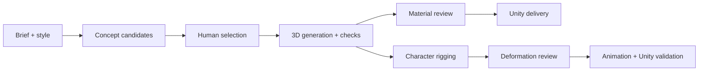

# SlopForge

**Turn an asset brief into a reviewed 3D game asset.**

SlopForge connects ComfyUI generation, Blender processing, human review, and Unity delivery. Run inference locally or on a remote GPU; keep your assets, approval decisions, and provenance in your own project.

[Get started](docs/INSTALL.md) · [Documentation](docs/README.md) · [Examples](docs/EXAMPLES.md) · [Roadmap](docs/CAPABILITY-ROADMAP-2026.md)

## See it working

| Reviewed humanoid | Prop delivery |
| :---: | :---: |
|  |  |
| **Basalt Warden** — body deformation approved; valid Unity Humanoid and evaluated diagnostic animation. [Evidence →](docs/media/character-qualification-2026-10/basalt-corrected-humanoid/README.md) | **Power relay** — mesh, materials, and Unity import demonstrated. Reconstruction defects remain visible. [Pipeline notes →](docs/archive/mesh-texturing-2026-10-02.md) |

These are measured examples. Generation is stochastic: candidates must pass checks and human review, or the pipeline reports failure. A successful export alone does not make an asset game-ready.

## The workflow



- **Generate:** props, collectibles, architecture, and humanoid character candidates using configurable ComfyUI workflows.
- **Prepare:** inspect geometry, preserve sources, process meshes and PBR maps, and render review views in Blender.
- **Review:** compare candidates, approve explicitly, and retain failed attempts and processing evidence.
- **Coordinate:** resume recipes, reuse style/reference libraries, and select quality tiers with bounded candidate budgets.
- **Deliver:** export models/materials and prepare character animation tooling for Unity.

## Quick start

Requires **Python 3.10–3.14**, Blender, a compatible ComfyUI service, and an existing Unity project. Model weights and custom nodes are installed separately.

```sh
git clone https://github.com/gysahlgreene/SlopForge.git
cd SlopForge
python3 -m venv .venv
source .venv/bin/activate
pip install -e .
slopforge init ~/UnityProjects/MyGame
slopforge --project ~/UnityProjects/MyGame doctor
```

[Installation](docs/INSTALL.md) covers dependencies. [ComfyUI configuration](docs/COMFYUI.md) covers local/remote inference and model/workflow compatibility.

### Generate a prop

```sh
slopforge --project ~/UnityProjects/MyGame generate prop stone_lantern \
  "Weathered stone lantern for a fantasy ruin" \
  --image-prompt "Squat carved stone lantern, broad square cap, open sides, warm glass core; complete three-quarter view, isolated on a plain neutral background."
slopforge --project ~/UnityProjects/MyGame candidates stone_lantern
slopforge --project ~/UnityProjects/MyGame approve stone_lantern 1
slopforge --project ~/UnityProjects/MyGame candidates stone_lantern
slopforge --project ~/UnityProjects/MyGame approve-texture stone_lantern 1
```

Inspect the concept, mesh views, materials, and validation report before each approval. For characters, continue through [readiness and rigging](docs/CHARACTER-RIGGING.md), then [animation validation](docs/CHARACTER-ANIMATIONS.md).

## What is qualified today?

| Area | Current evidence |
| --- | --- |
| Generation, candidate tracking, recipes, provenance | Implemented; offline tests and selected live GPU runs. Visual quality depends on the model and brief. |
| Mesh/material preparation and Unity delivery | Demonstrated on selected props; geometry and material defects still require review. |
| Humanoid rigging | One generated Basalt candidate has approved body deformation and valid Unity Humanoid evaluation. Providers remain experimental. |
| Third-party motion retargeting | Plumbing and fixture evidence exist; production idle/walk/attack qualification remains open. |
| Safe Unity replacement/reimport | Stable GUIDs and replacement validation remain open. |

Full finger animation is not available on the reviewed Basalt rig. Reference-input plumbing exists, but the bundled concept graph is text-only. SlopForge does not assemble game scenes or ship sprites; the pipeline remains a qualified asset workflow rather than a game engine.

## Find your way around

| Directory | Purpose |
| --- | --- |
| `slopforge/` | CLI, asset lifecycle, recipes, providers, and Unity integration |
| `blender/` · `processing/` | Background mesh, rigging, and image helpers |
| `workflows/` · `templates/` | ComfyUI graphs, requirement declarations, and project defaults |
| `tests/` | Offline checks and opt-in Blender, Unity, and GPU integrations |
| `docs/` | Guides, current audit, research, and compact benchmark evidence |

[Contributing](CONTRIBUTING.md) · [Security and publishing](SECURITY.md) · [MIT license](LICENSE) · [Third-party notices](THIRD_PARTY_NOTICES.md)
