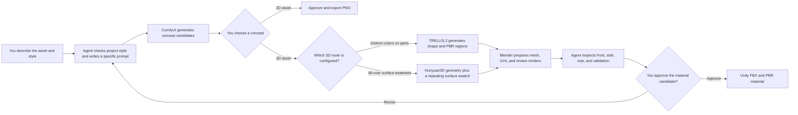
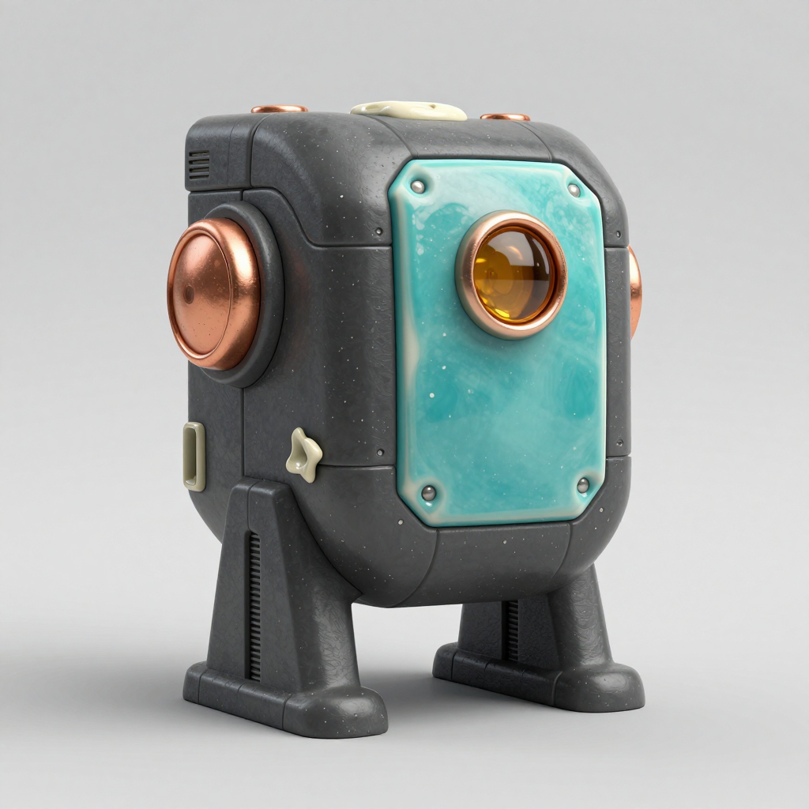
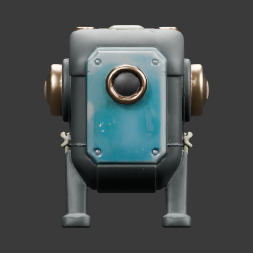
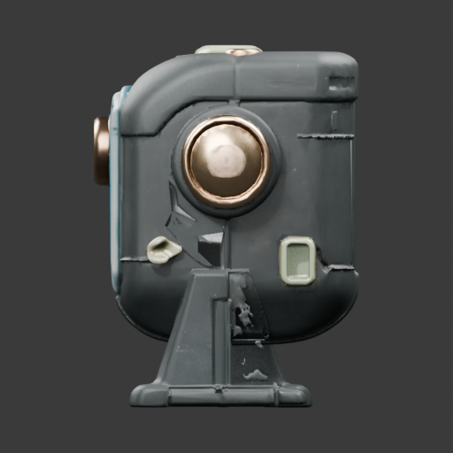
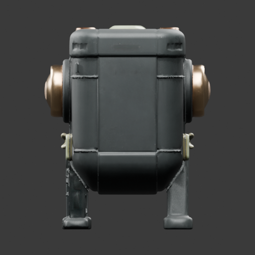

# SlopForge

<p align="center">
  
  
  
</p>

SlopForge is a local-first tool that uses ComfyUI and Blender to generate 2D art and 3D props from descriptions and project style settings, then exports approved assets into a Unity project.

SlopForge is primarily an **agent-driven asset workflow**: an agent authors prompts, reviews generated candidates and mesh views, and iterates with you. SlopForge runs the local tools and keeps candidates separate until you approve them.



The agent handles prompt writing and candidate review; **you choose the concept and approve the final asset**. For different materials on named parts, configure the [mesh-aware TRELLIS.2 workflow](docs/AGENT-INTEGRATION.md#mesh-aware-materials). Hunyuan3D with a surface swatch is intended for an all-over treatment and does not know which named part should receive which color.

## Example: a multicolor prop from concept to Unity

These images follow one concept through mesh-aware material generation and a Unity material import check.

<table>
  <tr>
    <th>Approved concept direction</th>
    <th>Unity import, three-quarter view</th>
  </tr>
  <tr>
    <td></td>
    <td></td>
  </tr>
</table>

The concept image guides the shape and material regions; it is **not** used as the mesh texture. TRELLIS.2 generates the mesh-aware material fields, which SlopForge bakes into UV maps.

<table>
  <tr><th>Front</th><th>Side</th><th>Rear</th></tr>
  <tr>
    <td></td>
    <td></td>
    <td></td>
  </tr>
</table>

> [!NOTE]
> This is an experimental, **unapproved** candidate. The Unity image verifies that the FBX material maps are assigned in a temporary Unity project using the built-in Standard shader; target-project lighting and URP were not tested. The side view still shows mesh reconstruction defects, so inspect all views and validation warnings before approval.

## What can SlopForge make?

- 2D icons and props
- Inventory UI assets and item art
- Stylized environmental props
- 3D generated props with Blender cleanup and FBX export
- Generate candidates, review them, and approve assets for export

## Quick start

```sh
python3 -m venv .venv
source .venv/bin/activate
pip install -e .
slopforge --help
slopforge init ~/UnityProjects/MyGame
```

For first-time setup on macOS, use `PYTHON_BIN=python3.12 ./scripts/install-macos.sh` and follow [docs/SETUP.md](docs/SETUP.md) for the route-specific dependencies.

For a guided terminal walkthrough—from style and asset description through visual review and approval—run:

```sh
slopforge --project ~/UnityProjects/MyGame make
```

The guided flow initializes SlopForge in an existing Unity project if needed. ComfyUI must be running for generated 2D and 3D assets. Experienced users can still use the individual commands below.

## Create a 2D asset

Generation creates reviewable candidates under the project's `ai/assets/candidates/`. Approve one to copy it to the configured Unity output directory:

```sh
slopforge --project ~/UnityProjects/MyGame generate icon health_potion \
  "Health potion inventory icon"
slopforge --project ~/UnityProjects/MyGame candidates health_potion
slopforge --project ~/UnityProjects/MyGame approve health_potion 2
```

## Create a 3D asset

```sh
slopforge --project ~/UnityProjects/MyGame generate prop alien_terminal \
  "Wall-mounted terminal controlling sealed doors" \
  --image-prompt "Broad wall-mounted alien terminal, recessed cyan display above three tactile controls, complete front three-quarter view, isolated on plain neutral background, stylized painted sci-fi game prop."
slopforge --project ~/UnityProjects/MyGame candidates alien_terminal
slopforge --project ~/UnityProjects/MyGame approve alien_terminal 1
slopforge --project ~/UnityProjects/MyGame candidates alien_terminal
slopforge --project ~/UnityProjects/MyGame approve-texture alien_terminal 1
```

For mesh-aware TRELLIS.2 materials, put the desired part colors in `--image-prompt`; revise and regenerate the concept if the material design needs to change. For the Hunyuan3D swatch route, `retexture` can create new all-over surface candidates on the saved mesh. In both routes, the agent should inspect front, side, and rear previews and validation warnings, then ask you to choose before `approve-texture`. Unity material export requires Unity project metadata and the Unity CLI. The guided `make` flow remains available for interactive use.

## Example projects and workflows

See [docs/EXAMPLES.md](docs/EXAMPLES.md) for practical examples of:

- inventory icon generation
- environmental props
- style-pack switching
- candidate review and approval loops
- Unity import and iteration workflows

## Architecture

- `slopforge/`: the Python package for the project-aware CLI, config, taxonomy, style prompts, manifest, candidate handling, validation, and pipelines.
- `processing/`: ComfyUI API calls, 3D input preparation, and PBR maps.
- `blender/`: GLB-to-Blend/FBX processing and Blender-based model inspection.
- `workflows/`: bundled ComfyUI API graph defaults.
- `templates/`: project initialization files, taxonomy, and optional agent instructions.
- `examples/`: sample style data.

Workflow precedence is project override first (`ai/workflows/<configured path>`), then the toolkit's bundled `workflows/`. Set a filename in project configuration to make that override easy to manage.

## Requirements

- Python 3.10–3.14 and the packages declared by `pyproject.toml`.
- ComfyUI and image models for generated 2D assets.
- Blender and the CPU ONNX backend from `rembg[cpu]` for 3D assets; the selected 3D route also needs its ComfyUI workflow, nodes, and model weights.
- An existing Unity project (`Assets/` directory) as the output target.

Only Python and SlopForge are needed for prompts/configuration and the Unity-native `primitive` route. See [docs/SETUP.md](docs/SETUP.md) for installation, model locations, agent setup, and route-specific dependencies.

## Agent integration

`slopforge init` installs agent instructions for Codex, Claude Code, and Continue. Agents invoke the same CLI as developers; the instructions guide them to inspect the manifest, style, and existing assets, review candidates, and verify approved outputs.

## Configuration and diagnostics

Use `slopforge --project PATH styles`, `assets`, `inspect NAME`, `doctor`, and `prompt TYPE DESCRIPTION`. `slopforge doctor` is diagnostic and does not install or modify anything. Project paths are configured with `ai/project.yaml` and environment overrides such as `COMFYUI_URL`, `COMFYUI_HOME`, `BLENDER_BIN`, and others.

## Current limitations

- Reference images are organized and recorded but are not used as visual conditioning.
- 3D generation remains experimental: mesh shape and material regions vary, and reconstruction defects can remain. Review all mesh views before approval. The TRELLIS.2 route places distinct colors on the mesh but can take many minutes on Apple MPS; its current normal map is flat, emission is zero, and glass transmission is not generated.
- The Hunyuan3D swatch route creates an all-over material treatment rather than assigning colors to named parts; roughness, metallic, and emission are heuristic, and seamless tiling is not guaranteed.
- Model weights are not included. Known source links and expected ComfyUI destinations are documented, but availability and model terms should be checked upstream.
- SlopForge is MIT licensed. Separately installed model weights and ComfyUI custom nodes have their own terms; see `THIRD_PARTY_NOTICES.md`.
