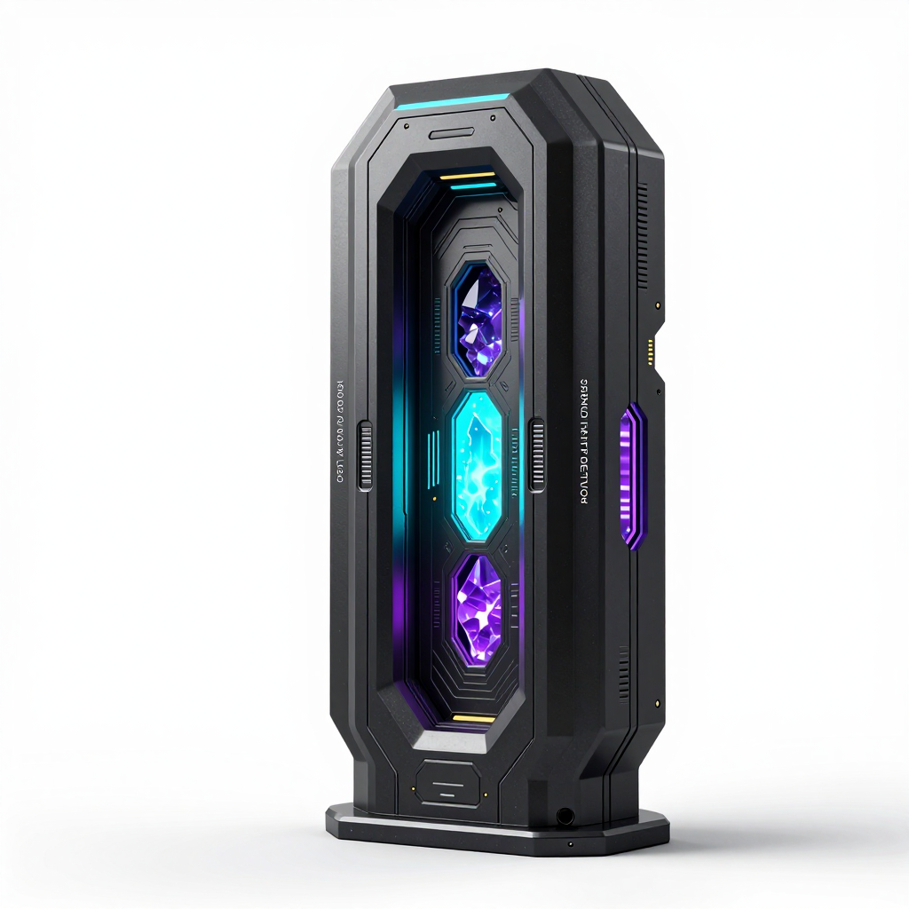
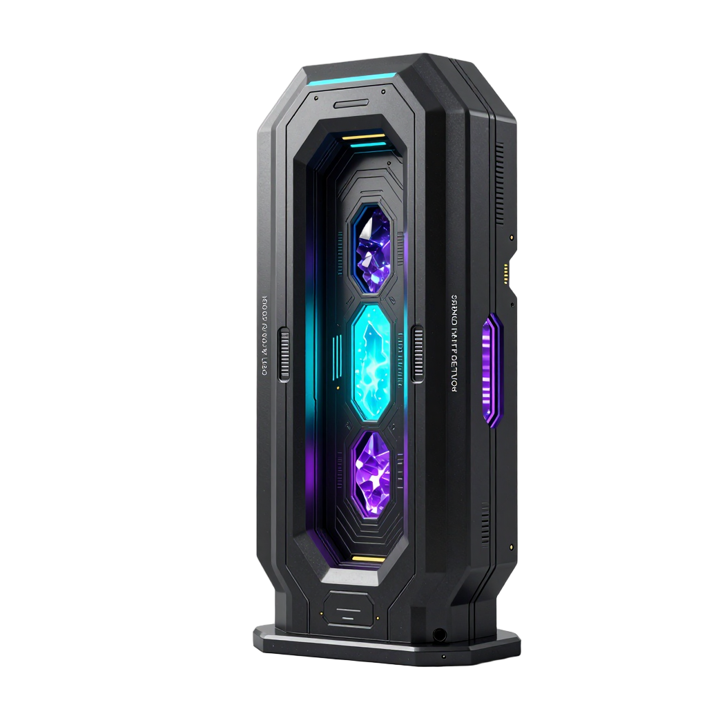
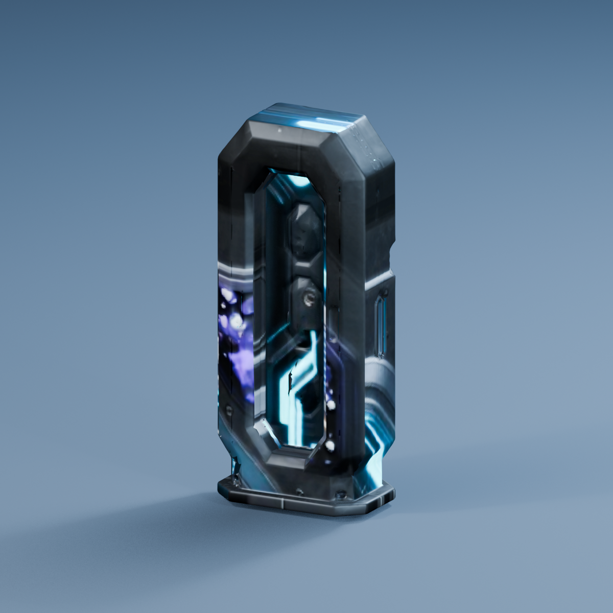
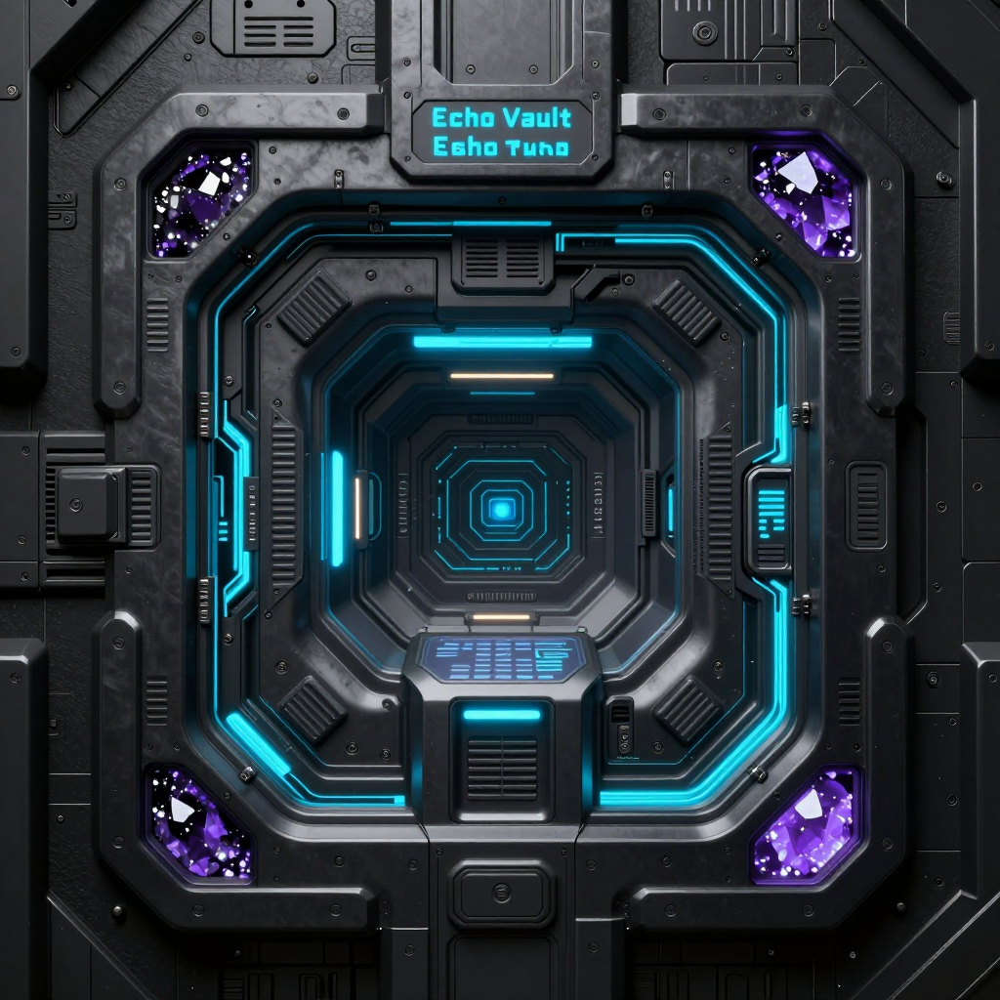
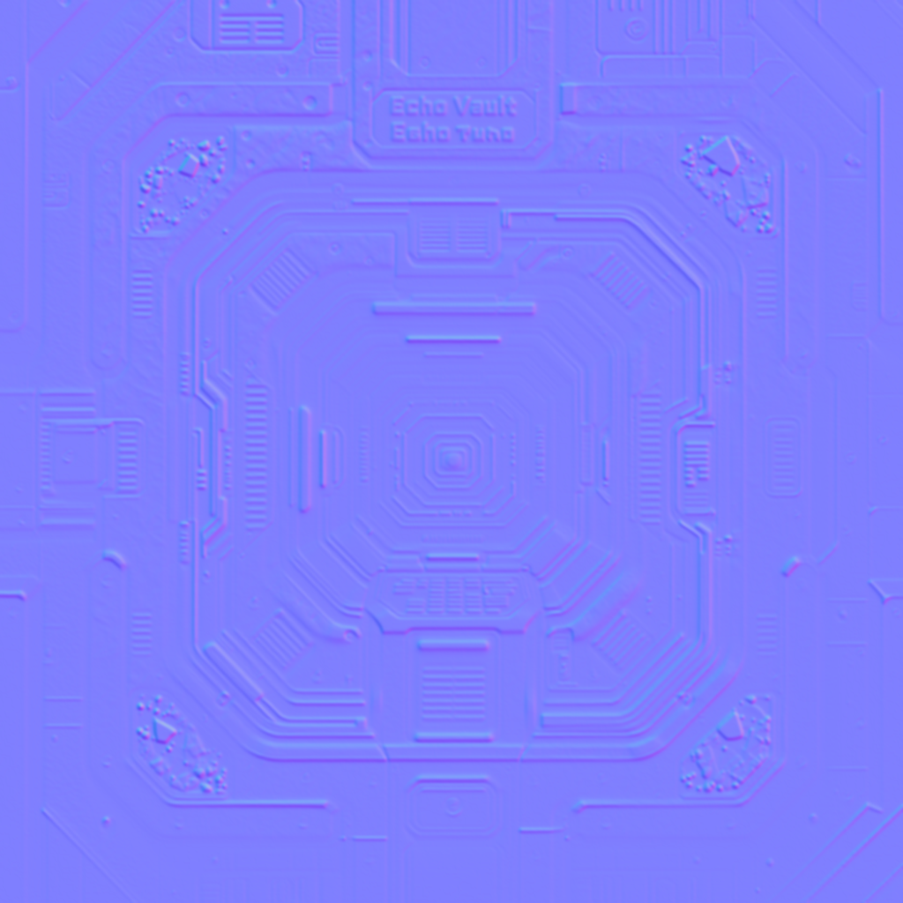
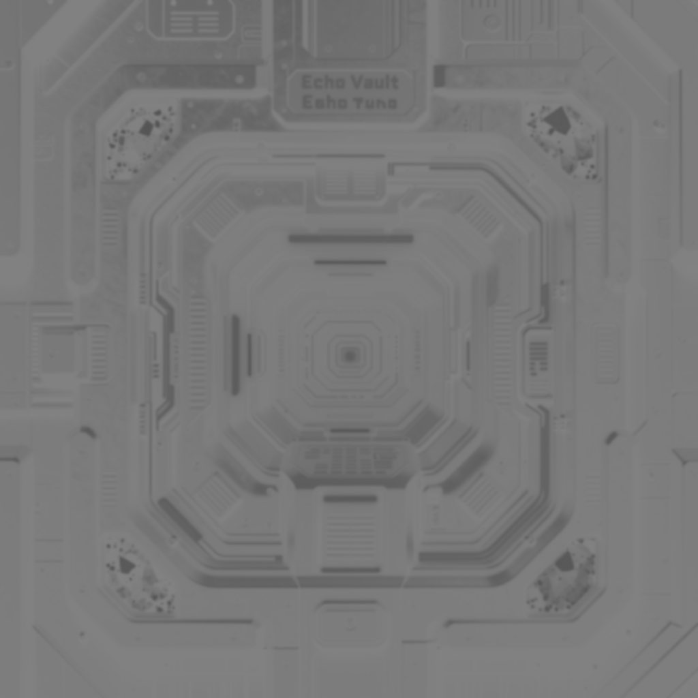
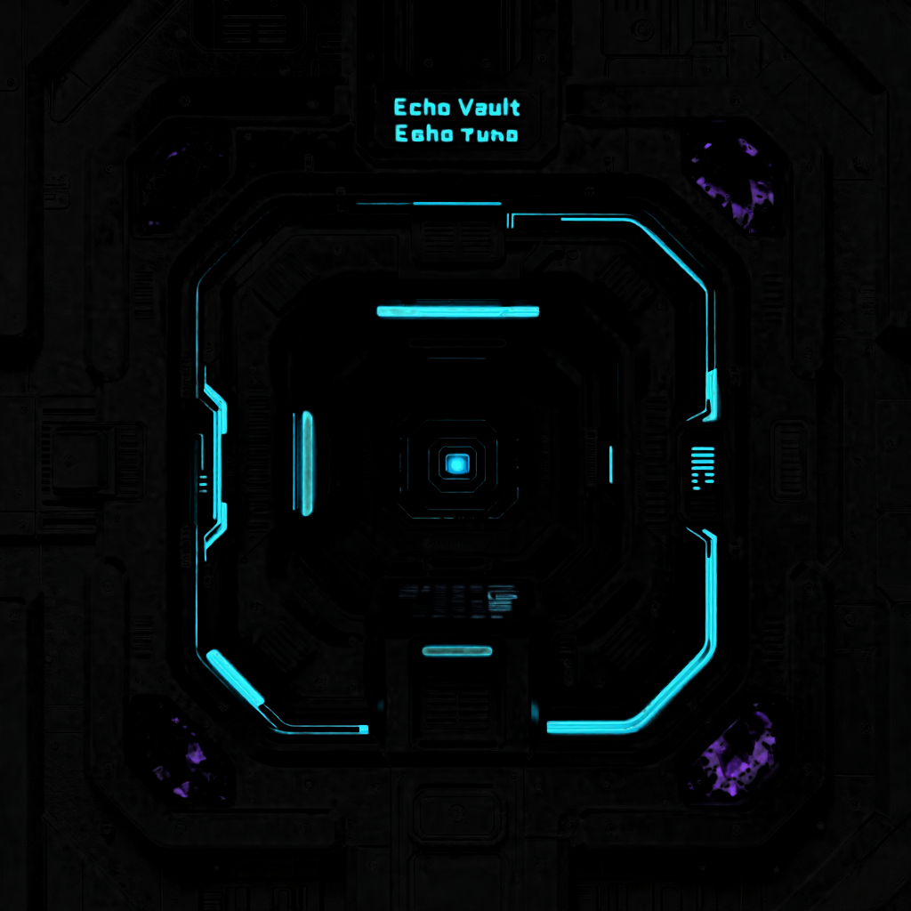

# SlopForge

<p align="center">
  
  
  
</p>

SlopForge is a local-first tool that uses ComfyUI and Blender to generate 2D art and 3D props from descriptions and project style settings, then exports approved assets into a Unity project.

```text
semantic description
→ project art direction
→ ComfyUI concept candidates
→ background isolation
→ 2D approval or Hunyuan3D
→ Blender cleanup, UVs, scale, and PBR
→ Unity-ready PNG or FBX
```

## Alien Terminal example

These images show one prop moving through the 3D pipeline: concept, background removal, prepared model input, and Blender output.

<table>
  <tr>
    <th>Concept</th>
    <th>Background removed</th>
    <th>Blender output</th>
  </tr>
  <tr>
    <td></td>
    <td></td>
    <td></td>
  </tr>
</table>

> [!NOTE]
> Texture-to-mesh mapping is WIP. The Alien Terminal preview shows visible stretching and misplaced texture details.

  <summary>Generated material maps</summary>
  <table>
    <tr>
      <th>Base color</th>
      <th>Normal</th>
      <th>Roughness</th>
      <th>Metallic</th>
      <th>Emission</th>
    </tr>
    <tr>
      <td></td>
      <td></td>
      <td></td>
      <td></td>
      <td></td>
    </tr>
  </table>
  <p>Material maps are heuristic outputs; their quality varies by asset.</p>

## What can SlopForge make?

- 2D icons and props
- Inventory UI assets and item art
- Stylized environmental props
- 3D generated props with Blender cleanup and FBX export
- Generate candidates, review them, and approve assets for export

## Quick start

```sh
python3 -m venv .venv
source .venv/bin/activate
pip install -e .
slopforge --help
slopforge init ~/UnityProjects/MyGame
```

For first-time setup on macOS, use `PYTHON_BIN=python3.12 ./scripts/install-macos.sh` and follow [docs/SETUP.md](docs/SETUP.md) for the route-specific dependencies.

Run commands from the project root to discover `ai/project.yaml`, or pass the project explicitly:

```sh
slopforge --project ~/UnityProjects/MyGame generate icon health_potion \
  "Health potion inventory icon"
```

## Create a 2D asset

Generation creates reviewable candidates under the project's `ai/assets/candidates/`. Approve one to copy it to the configured Unity output directory:

```sh
slopforge --project ~/UnityProjects/MyGame generate icon health_potion \
  "Health potion inventory icon"
slopforge --project ~/UnityProjects/MyGame candidates health_potion
slopforge --project ~/UnityProjects/MyGame approve health_potion 2
```

## Create a 3D asset

```sh
slopforge --project ~/UnityProjects/MyGame generate prop alien_terminal \
  "Wall-mounted terminal controlling sealed doors"
slopforge --project ~/UnityProjects/MyGame candidates alien_terminal
slopforge --project ~/UnityProjects/MyGame approve alien_terminal 2
```

## Example projects and workflows

See [docs/EXAMPLES.md](docs/EXAMPLES.md) for practical examples of:

- inventory icon generation
- environmental props
- style-pack switching
- candidate review and approval loops
- Unity import and iteration workflows

## Architecture

- `slopforge/`: the Python package for the project-aware CLI, config, taxonomy, style prompts, manifest, candidate handling, validation, and pipelines.
- `processing/`: ComfyUI API calls, 3D input preparation, and PBR maps.
- `blender/`: GLB-to-Blend/FBX processing and Blender-based model inspection.
- `workflows/`: bundled ComfyUI API graph defaults.
- `templates/`: project initialization files, taxonomy, and optional agent instructions.
- `examples/`: sample style data.

Workflow precedence is project override first (`ai/workflows/<configured path>`), then the toolkit's bundled `workflows/`. Set a filename in project configuration to make that override easy to manage.

## Requirements

- Python 3.10–3.14 and the packages declared by `pyproject.toml`.
- ComfyUI and image models for generated 2D assets.
- Blender, Hunyuan3D nodes/model, and the CPU ONNX backend from `rembg[cpu]` for 3D assets.
- An existing Unity project (`Assets/` directory) as the output target.

Only Python and SlopForge are needed for prompts/configuration and the Unity-native `primitive` route. See [docs/SETUP.md](docs/SETUP.md) for installation, model locations, agent setup, and route-specific dependencies.

## Agent integration

`slopforge init` installs agent instructions for Codex, Claude Code, and Continue. Agents invoke the same CLI as developers; the instructions guide them to inspect the manifest, style, and existing assets, review candidates, and verify approved outputs.

## Configuration and diagnostics

Use `slopforge --project PATH styles`, `assets`, `inspect NAME`, `doctor`, and `prompt TYPE DESCRIPTION`. `slopforge doctor` is diagnostic and does not install or modify anything. Project paths are configured with `ai/project.yaml` and environment overrides such as `COMFYUI_URL`, `COMFYUI_HOME`, `BLENDER_BIN`, and others.

## Current limitations

- Reference images are organized and recorded but are not used as visual conditioning.
- Texture-to-mesh mapping is WIP: generated textures can stretch or land on the wrong parts of a mesh. PBR maps are heuristic outputs.
- Hunyuan3D and Blender results depend on local models, nodes, and hardware; the 3D pipeline remains experimental.
- Model weights are not included. Known source links and expected ComfyUI destinations are documented, but availability and model terms should be checked upstream.
- SlopForge is MIT licensed. Separately installed model weights and ComfyUI custom nodes have their own terms; see `THIRD_PARTY_NOTICES.md`.
