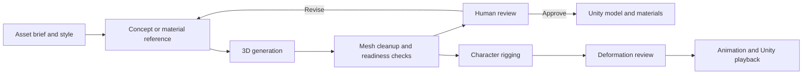

# SlopForge

SlopForge is a local-first workflow for creating and preparing 3D game assets. It coordinates ComfyUI for concept and mesh generation, Blender for mesh processing and review, and Unity for asset import. ComfyUI is an HTTP service: set `COMFYUI_URL` to use a local or remote host, and choose compatible workflows separately with `SLOPFORGE_COMPUTE_PROFILE`.

SlopForge keeps generated candidates separate until a person reviews and approves them. Its job is to make the generation and processing stages repeatable, traceable, and easier to inspect—not to claim every generated model is game-ready.



## Current state

The 3D generation, Blender processing, material export, candidate review, recipe, provenance, and Unity paths are implemented to different levels. Generated geometry can still have holes, disconnected parts, incomplete textures, and other defects. Character readiness checks are structural; they do not prove anatomy or deformation. Rigging providers are experimental, and a generated character is not qualified until its deformation has been visually reviewed and its animation has been played in Unity.

The committed [power relay example](img/power-relay-unity.png) documents a real mesh/material/import route and its visible reconstruction defects. It is evidence of the pipeline, not a quality guarantee.

See the [capability roadmap](docs/CAPABILITY-ROADMAP-2026.md), [audit](docs/AUDIT-2026-10.md), [workflow inventory](docs/WORKFLOWS.md), [character rigging notes](docs/CHARACTER-RIGGING.md), and [demo](docs/DEMO.md).

## Quick start

```sh
python3 -m venv .venv
source .venv/bin/activate
pip install -e .
slopforge --help
slopforge init ~/UnityProjects/MyGame
```

For macOS setup and route-specific dependencies, see [installation](docs/INSTALL.md) and [setup](docs/SETUP.md). The target must be an existing Unity project. Blender is used locally; ComfyUI can run locally or on a remote GPU host over HTTP.

## Generate a 3D prop

```sh
slopforge --project ~/UnityProjects/MyGame generate prop alien_terminal \
  "Wall-mounted alien terminal controlling sealed doors" \
  --image-prompt "Broad wall-mounted sci-fi terminal, recessed cyan display above three tactile controls, complete front three-quarter view, isolated on a plain neutral background."
slopforge --project ~/UnityProjects/MyGame candidates alien_terminal
slopforge --project ~/UnityProjects/MyGame approve alien_terminal 1
slopforge --project ~/UnityProjects/MyGame candidates alien_terminal
slopforge --project ~/UnityProjects/MyGame approve-texture alien_terminal 1
```

Review front, side, and rear previews and validation warnings before approving. TRELLIS.2 can generate mesh-aware material regions; the Hunyuan3D route uses an all-over surface swatch. Neither route guarantees clean topology or complete material coverage.

## Characters and coordinated 3D sets

Use `character_3d_pack` to generate a character model candidate. After approving the model, inspect readiness, normalize and review a clean candidate when needed, then rig it, review deformation poses, and validate animation in Unity. See [character rigging](docs/CHARACTER-RIGGING.md) and [character animation](docs/CHARACTER-ANIMATIONS.md) for the current stages and limitations.

Recipes coordinate related 3D assets, including modular environment kits. They resume after interruptions and stop for candidate approval; they do not infer a game plan from a natural-language pitch. See [recipe orchestration](docs/RECIPES.md) and [environment kits](docs/ENVIRONMENT-KITS.md).

## What SlopForge ships

- 3D asset types for props, collectibles, architecture, and characters.
- Concept and material images as supporting inputs to 3D generation.
- Candidate review, provenance, reference libraries, quality tiers, and resumable 3D recipes.
- Blender mesh inspection/processing, character readiness and rigging stages, and Unity model/material/animation tooling.
- Local or remote ComfyUI over HTTP, isolated from local Blender processing.

## Requirements and limitations

- Python 3.10–3.14 and dependencies in `pyproject.toml`.
- An existing Unity project with `Assets/`.
- ComfyUI with a compatible image-to-3D workflow and its separately installed model weights/nodes.
- Blender for mesh processing and character tooling.
- Model weights are not included. Their licenses and commercial terms are separate from SlopForge's MIT license; see `THIRD_PARTY_NOTICES.md`.
- The bundled concept graph is text-only. Reference-conditioned 3D generation depends on a workflow that accepts mapped reference inputs.
- Unity import success does not prove a model is visually good, properly rigged, or animation-ready. Human review and visible engine validation remain required.

## Documentation

- [Examples](docs/EXAMPLES.md)
- [Architecture](docs/ARCHITECTURE.md)
- [ComfyUI setup](docs/COMFYUI.md)
- [Workflow inventory](docs/WORKFLOWS.md)
- [Review board](docs/REVIEW-BOARD.md)
- [Quality tiers](docs/QUALITY-TIERS.md)
- [Unity delivery](docs/UNITY.md)
- [Environment kits](docs/ENVIRONMENT-KITS.md)

## Reviewed humanoid benchmark

Basalt Warden now has a valid Unity Humanoid rig, an eight-second diagnostic animation, and user-approved body deformation. [Watch the animation and inspect the evidence](docs/media/character-qualification-2026-10/basalt-corrected-humanoid/README.md). This validates the benchmark candidate; future assets still require individual qualification. Full finger animation and third-party motion validation remain outstanding.
