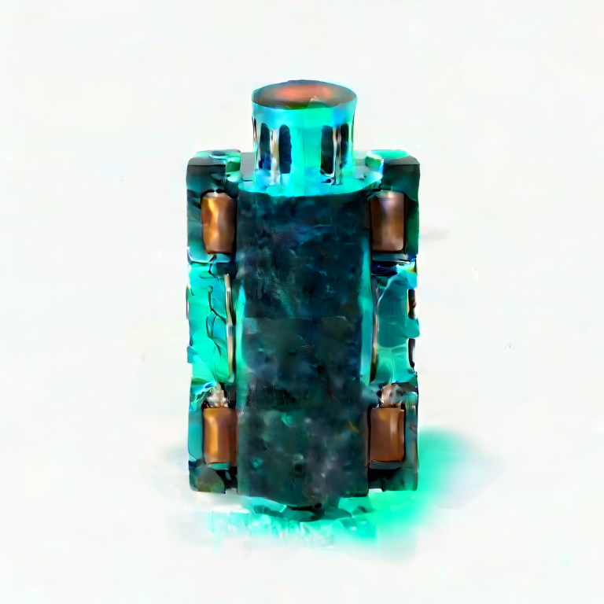

# Reference conditioning qualification

The `character.reference_conditioning.wan22_ti2v` workflow completed a paired
inference through SlopForge's ComfyUI runner on the remote `h100` profile on
2026-10-04. Both runs used the same graph SHA-256, model files, prompt, negative
prompt, and seed. One used the approved `power-relay-concept` reference; the
control used a neutral gray image with no approved asset selected.

| Neutral control | Approved reference |
| --- | --- |
|  |  |

The approved-reference output retains the source relay's chunky charcoal
housing, turquoise plate, copper couplings, and amber lens. The neutral-control
output has a different narrow cylindrical silhouette. This is visible evidence
that the reference image affects this workflow's result.

Qualification: **visually reviewed experimental workflow**. This is evidence
for one image-to-video graph, not general character identity preservation. The
selected final frame is close to the source reference, so this run does not
prove useful motion, pose transfer, alpha handling, or sprite readiness. The
control uses a neutral image because this Wan graph expects an initial image;
it is not a text-only execution with the image input disconnected. The complete
prompt, seed, graph hash, reference hash/ID, outputs, and per-run ComfyUI
provenance are in [the evidence manifest](../media/reference-conditioning/manifest.json).

## Reproduce

Requirements: ComfyUI with the core nodes and Wan 2.2 TI2V 5B, UMT5, and VAE
weights named in the workflow sidecar. Upload the neutral control image to the
configured ComfyUI server before the control run:

```sh
curl -F 'image=@docs/media/reference-conditioning/neutral-control.png' \
  -F 'subfolder=slopforge/reference-conditioning' \
  "$COMFYUI_URL/upload/image"
```

Run the neutral-control case with the command recorded in the media manifest.
For the approved-reference case, pass the project-approved image through
`--references` and map the upload to node `7`, input `image`:

```json
[{"image":{"node":"7","input":"image"}}]
```

Use identical prompts and seeds for the pair. The workflow's adjacent
`requirements.yaml` sidecar declares its graph nodes, model names, inputs,
outputs, and tested profile. No model or custom node was installed for this
qualification.
