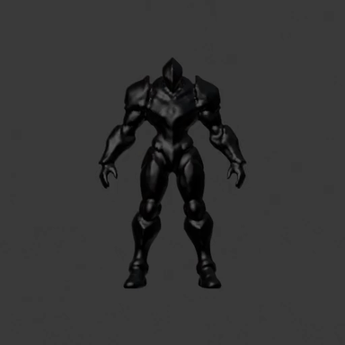

# Basalt Warden: reviewed Humanoid benchmark

[Watch the eight-second motion test](motion-test.mp4) · [Validation report](Validation-Summary.json) · [Unity mapping and motion results](Unity-Humanoid-Validation.txt)

[Full-resolution raised-arm pose](raised-arms.png)

On 2026-10-07 Eoin reviewed the delivered rig and animation in Blender and confirmed “all good.” This records approval of body deformation for this candidate. It does not automatically approve future generated humanoids.

## What changed

SkinTokens arm classification previously mistook rising shoulder stubs for upper arms. The shared postprocessor now selects the actual upper-arm branch, names the Humanoid body hierarchy, retains normalized weights, and rebakes available maps at source resolution. Regression coverage includes arms with and without shoulder stubs. Original predicted joint positions and weights are preserved.

## Evidence

- [Canonical source input-contract check](Input-Contract-Validation.json): the source SHA-256 matches the source recorded by the reviewed rig. Blender 5.1 measured one mesh, 43,480 faces, four connected components, zero boundary/non-manifold/degenerate geometry, UVs/materials/linked textures, and no missing texture files or auxiliary objects. Readiness remains `needs_review`, with pending approval of component layout, material fidelity, orientation and rest pose. The earlier failing raw-rig probe is a different file and does not describe this source.
- Original source and raw-rig hashes, checkpoint hash, provider revision, compatibility patch hash and seed: [report](Validation-Summary.json).
- Blender 5.1 fresh FBX import: one mesh, one 28-bone armature, all vertices weighted, at most four influences, normalized weight sums.
- Unity 6000.6.3f1: valid Humanoid Avatar with all required body joints; eight-second diagnostic clip evaluated through an initialized Animator PlayableGraph, with maximum skinned vertex displacement 0.4485983 in mesh coordinates. Reproduction script: [Unity-RigCheck.cs](Unity-RigCheck.cs).
- [Side crouch](Side-121.png), [rear arm raise](Rear-025.png), [three-quarter elbow bend](ThreeQuarter-073.png). MP4 is rendered from the delivered Blender action, not captured from Unity.
- Full repository verification: 206 tests passed, 6 skipped, 26 subtests passed. Three Pillow deprecation warnings remain.

## Scope and limits

The clip tests arm raises, elbow bends, crouch and leg lift; it is not a production walk cycle. One finger chain exists per hand; full finger animation is unavailable. Third-party animation retargeting, Mixamo upload and production material fidelity are not qualified by these checks. This is a passing body-deformation benchmark, not a guarantee of perfect rigs or complete game readiness.

Test FBX and Blender scene remain in Downloads under `Basalt-Warden-3D-Review/SlopForge-H100-Candidate/Rigged-Review-v4`. Raw sources, failed candidates and delivery binaries are kept outside Git. Future assets must still pass their own structural checks, human deformation review and Unity validation.
