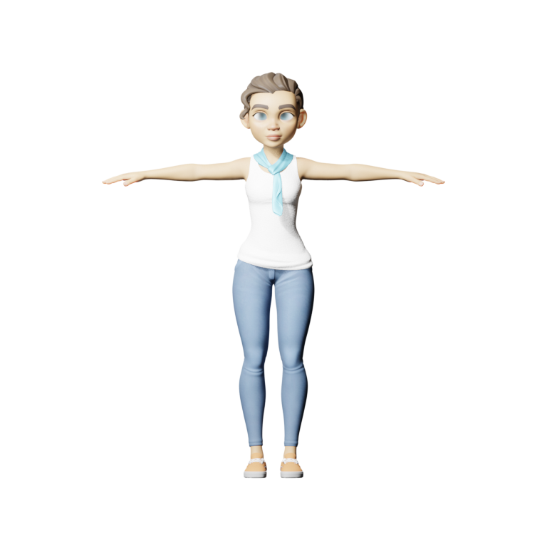
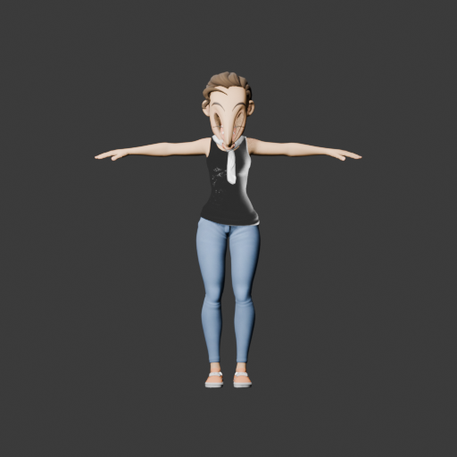
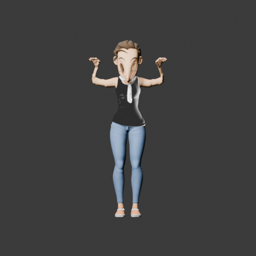
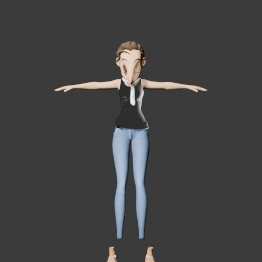
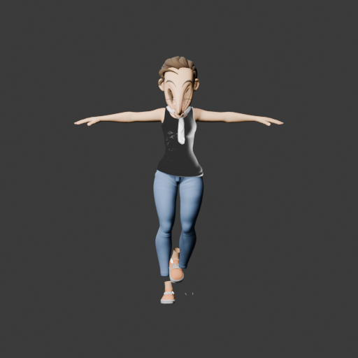
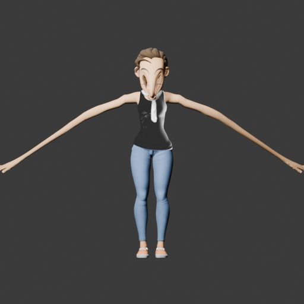
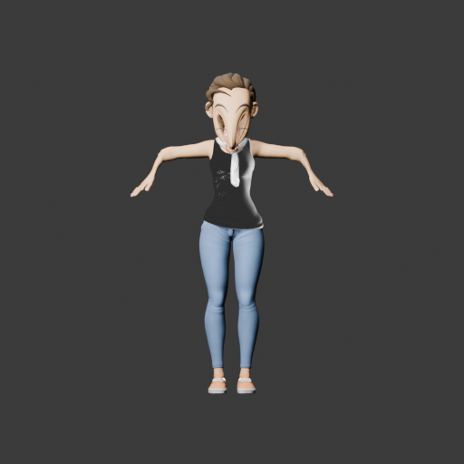

# Rain rig qualification probe — 2026-10-06

Rain v3.3 was downloaded from Blender Studio and opened with Blender 5.1.0 and `--disable-autoexec`. Its embedded `cloudrig.py` and `rain_shading.py` text blocks were not run. The source ZIP SHA-256 is `80217f163f6392dc829233d63c2cfb5e1376775bc34101ad14f39631fea70d24`; the ZIP and model are retained in `/tmp/slopforge-golden-rig-bench/rain/`, not in this repository.

Attribution for this CC BY 4.0 derived render/evidence: **“Rain Rig (CC) Blender Foundation | studio.blender.org”** — [Rain v3](https://studio.blender.org/characters/rain/v3/), [CC BY 4.0](https://creativecommons.org/licenses/by/4.0/). The provider result is a disposable benchmark, not an approved SlopForge character or a redistributed game asset.

The neutral render shows the source character in its authored A-pose. The source rig has 2,166 bones, 392 deform bones, 18 visible geometry meshes, and no active body animation. The embedded actions animate facial controls only.

`rain-neutral-unrigged.glb` was exported from the visible `GEO-rain-*` meshes at frame 1 with evaluated geometry, materials, no armature, and no vertex groups. Its SHA-256 is `426269bf9f1079c68705256c36917ba0e02746ae7a8dc1fbafc2149987a4d280`. Rain's original `.blend` and authored control rig were left untouched.

The checked-in Rigify provider refused this input because it reports 2,960 `not edge.is_manifold` edges. An independent BMesh check after the same vertex weld classifies those as boundary edges; it found zero edges with more than two incident faces. A disposable copy of the provider changed only that classification to allow boundary edges while still rejecting other non-manifold edges. It generated a 160-deform-bone rig and FBX, but the six existing diagnostic renders show unacceptable face/shoulder/limb distortion. Pose displacement numbers measure that something moved; they are not quality scores. FBX export also reported missing external texture paths. No Unity import/playback was run.

SkinTokens was evaluated at pinned upstream revision `273b691d35989d71cd17ff2895fdc735097b92d1`, checkpoint SHA-256 `f4e4706a11cfb520cdde65156a0358545e4fbf8f36237aca01ea5e79d5cb5692`, on the isolated H100 Python 3.11 environment with the existing SDPA compatibility shim. With texture transfer enabled, prediction completed but the upstream Blender helper connection closed during texture transfer over this 18-mesh, multi-material/UDIM model. With transfer disabled, inference completed in 14.4 seconds and wrote raw GLB SHA-256 `f097d5e0d5af517c405b409a82de71f320d6d9c8a86675e9b72a1dc015068cc8`: one fully weighted 231,429-vertex mesh, 79,594 faces, and 52 bones, plus an unskinned helper Icosphere. The product packager then failed to map the generated skeleton (`Ambiguous semantic right upper arm: 0 candidates`). There is no valid pose sheet and no deformation-quality conclusion for SkinTokens on Rain. GPU peak memory was not measured.

These runs show why a golden rig helps: the rigged original separates a source-control/import problem from an auto-rigging problem, while its neutral unrigged copy compares providers on identical geometry. They also show that SlopForge currently rejects legitimate boundary surfaces and that successful rig generation, weights, and displacement do not prove a usable character. SkinTokens' raw prediction is evidence of inference only; packaging, texture transfer, semantic mapping, deformation review, and engine playback remain separate gates.

## Visual evidence

Rigify using the current bounds fit and diagnostic controls (each panel is retained separately):

| Pose | Render |
|---|---|
| T pose |  |
| Raised arms |  |
| Crouch |  |
| Leg lift |  |
| Elbow bend |  |
| Shoulder rotation |  |

Machine-readable evidence: [`rigify_boundary_probe.json`](rigify_boundary_probe.json), [`skintokens_raw_inspection.json`](skintokens_raw_inspection.json), and [`skintokens_report.json`](skintokens_report.json).
