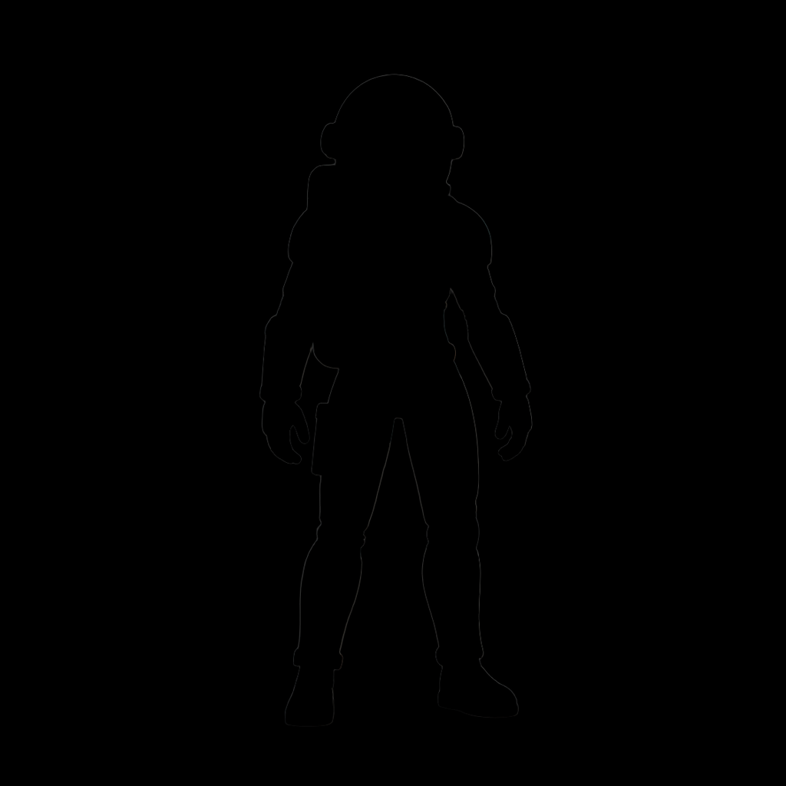
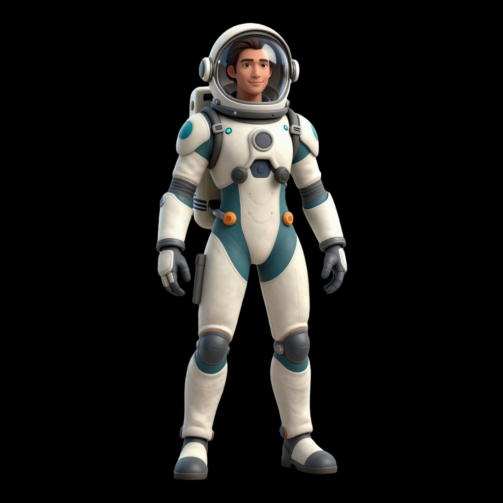
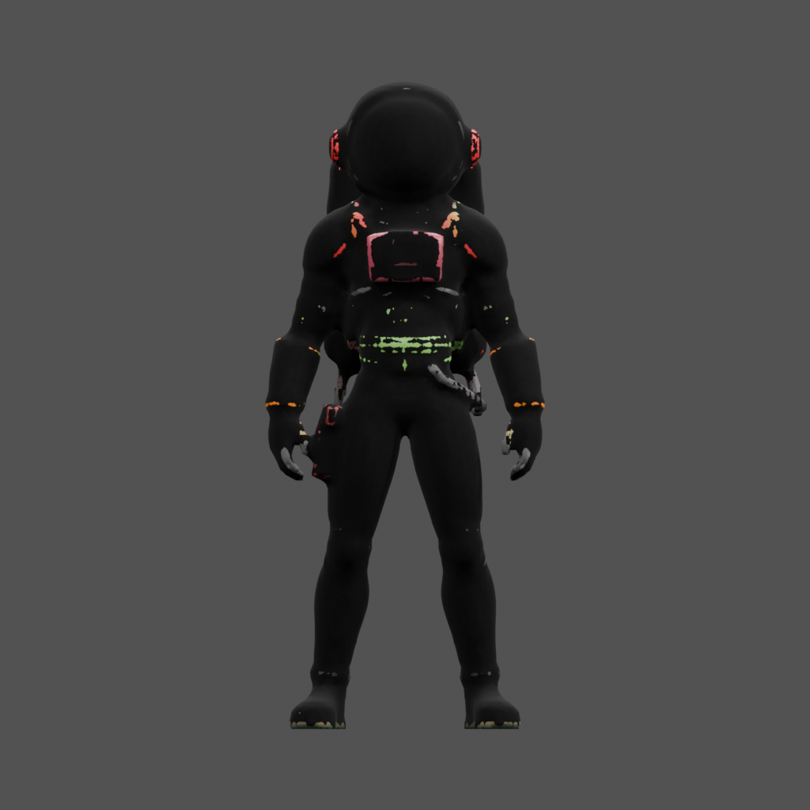
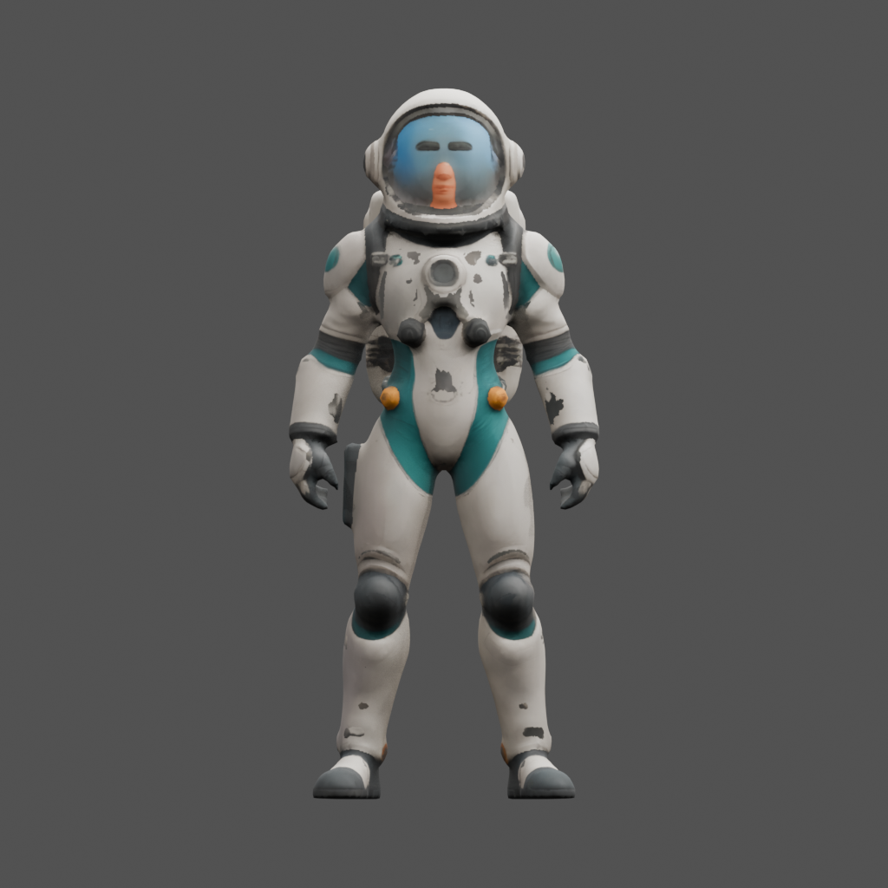
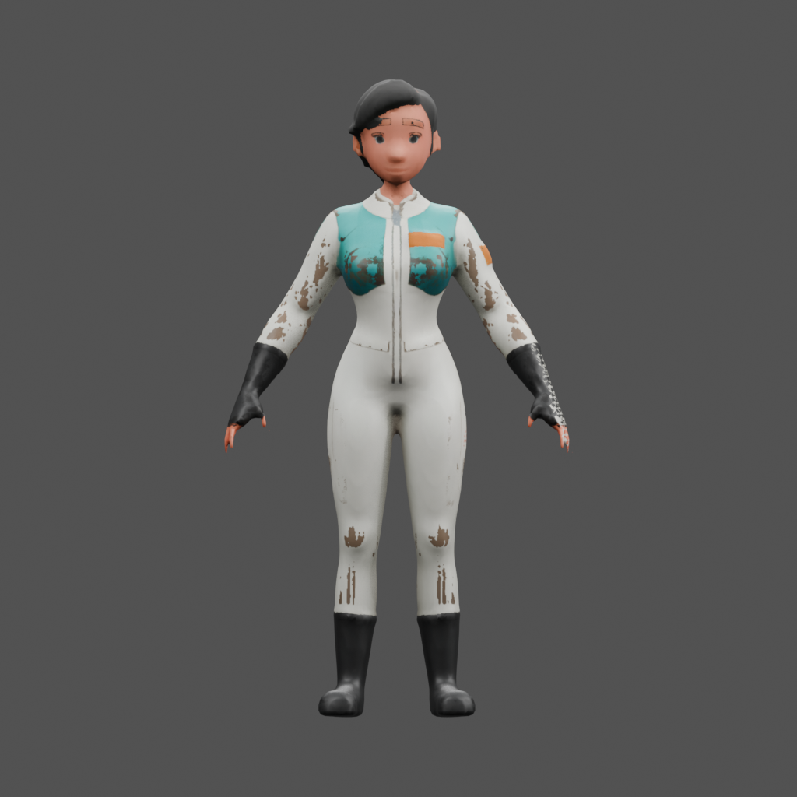

# Texture mask regression and recovery

The near-black texture failure is traced to input preparation and fixed in the
shared workflows. This report qualifies that failure class, not finished character
artwork, rigging, or Unity playback. Measurements are in [report.json](report.json).

## First failing boundary

The source PNG and upload were correct. ComfyUI `LoadImage` returns MASK as
`1 - alpha`: transparent background is 1. `ImageCropToMask` composites the subject
using a foreground mask, where the opaque subject must be 1. All four bundled
model graphs connected these opposite conventions directly.

The crop tried to guess polarity: invert only if the border mean is above 0.5
and the central mean is below 0.5. The broad known-good character accidentally
satisfied this heuristic; the narrower character missed it by 0.00113.

| Input | Transparency border mean | Central mean | Old heuristic |
| --- | ---: | ---: | --- |
| Humanoid test 3, earlier success | 1.000000 | 0.460282 | Inverted correctly |
| Humanoid test 7, failed case | 1.000000 | 0.501130 | Kept wrong polarity |

The first incorrect artifact was the conditioning crop: it erased the subject's
interior before DINO conditioning and inference. Finite latents, valid geometry,
UVs and readable texture files did not make this input correct. The saved base-color
PNG and embedded GLB texture contained identical pixels, ruling out final material
assignment as the cause.

| Failed conditioning | Corrected conditioning, same source |
| --- | --- |
|  |  |

## Durable correction

- Four TRELLIS/Pixal3D graphs now explicitly connect
  `LoadImage MASK → InvertMask → ImageCropToMask`.
- Requirements sidecars declare the added node and updated graph hashes.
- Static requirements, `doctor`, queue validation and model-approval preflight
  reject the old wiring. Approval stops before background removal or mesh retries.
- Generation saves and validates `conditioning.png`, recording its relative path
  in `generation.json`.
- Offline regressions cover wiring, preflight and corrupt/missing conditioning
  outputs. The native ComfyUI check exercises narrow, broad and RGB fixtures
  through the actual loader, inverter and crop nodes.

## Live verification

The failed case was regenerated using its original cutout and seed **1551714109**.
The fresh case used a newly generated concept (image seed **2090109008**, model
seed **2090109009**). Each ran shape generation, Blender preparation at a 60,000
triangle budget and repair resolution 120, native PBR baking at 4096², Blender
assembly/inspection, FBX export and four-view rendering.

The failed case then repeated those stages. Corrected conditioning pixels and
raw geometry matched the first corrected run. Atlases differ; pixel-identical
final textures are not guaranteed. All three runs have colored atlases and
resolved texture references.

| Original failure | Corrected render | Fresh input render |
| --- | --- | --- |
|  |  |  |

The old atlas was 93.34% completely black; the three recovered atlases have no
completely black pixels. Whole-atlas statistics include UV gutters and are
diagnostic comparisons, not universal thresholds. Intentional dark or constant
materials remain valid. Surface blotches and face/detail defects remain visible;
these are not approved finished characters. The fresh model has three disconnected
components requiring review. No rig or Unity walk is qualified here.

## Reproduce and check

Follow [Installation](../../INSTALL.md), then set `COMFYUI_URL` and `BLENDER_BIN`
for the intended service and Blender executable. From the repository:

```sh
make verify
make verify-live
```

Replay the failed input with the corrected graph:

```sh
python processing/comfy_generate_3d.py \
  --image docs/media/texture-mask-recovery-2026-10/source-cutout.png \
  --name humanoid-test-7-replay --seed 1551714109 \
  --dest private/texture-mask-replay/humanoid-test-7-replay.glb \
  --metadata private/texture-mask-replay/generation.json \
  --workflow workflows/trellis2_image_to_model_h100_api.json \
  --blender "$BLENDER_BIN" --face-budget 60000 --voxel-resolution 120 \
  --workflow-inputs '{"crop":{"pad_factor":1.1},"shape_upsample_stage":{"target_resolution":1536},"maps":{"texture_size":4096}}'
```

For the fresh case substitute [fresh-cutout.png](fresh-cutout.png), seed 2090109009,
and a separate output directory. Inspect `conditioning.png` first, then the maps
and GLB. The normal candidate pipeline owns Blender review and approval;
this diagnostic command does not approve an asset.

Run the crop regression on the ComfyUI host with that environment's Python:

```sh
python scripts/check_comfy_mask_polarity.py <ComfyUI-directory>
```

For deeper diagnosis, `scripts/comfy_texture_diagnostics.py` is an optional ComfyUI
custom node. Copy it to `custom_nodes/`, restart the service, and connect
`SlopForgeTextureDiagnostics` to loaded/cropped images, sampled shape/texture
latents, decoded voxel colors, mesh and shape subdivisions. It writes statistics
and tensor snapshots to `output/slopforge_diagnostics/`. Keep these large snapshots
and machine-specific histories outside public Git. Production graphs do not
depend on this node.
