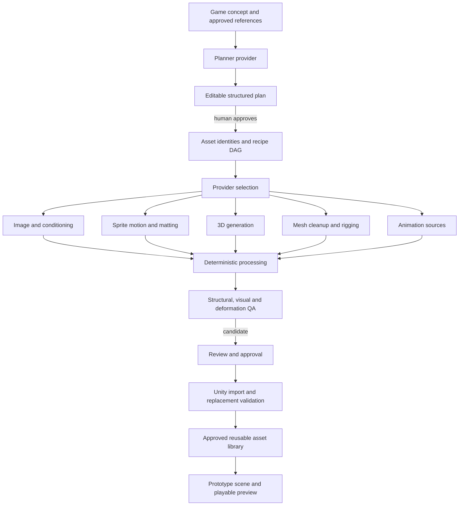

# Ecosystem audit: roadmap recommendation

**Date:** 2026-10-05
**Branch:** `codex/prototype-content-factory`
**Related evidence:** [capability matrix and licensing audit](ecosystem-capability-audit.md), [current implementation audit](../AUDIT-2026-10.md), [SkinTokens/UniRig provider audit](unirig-rigging-provider-audit.md), [ComfyUI workflow inventory](../WORKFLOWS.md).

## 1. Executive conclusion

SlopForge should be a **local-first, provider-independent asset production orchestrator**. Its durable product value is the structured plan, provider selection, workflow execution, deterministic post-processing, provenance, validation, review and engine handoff. It does not need to own or reimplement each image/video/3D/rigging model.

The current architecture already points in this direction: recipes and typed artifacts compose providers, ComfyUI is an HTTP inference service, Blender performs local deterministic processing, Unity owns engine import, and approvals separate AI candidates from accepted assets. Preserve that core. The largest roadmap adjustment is to stop treating #9, #14, and #16 as requests to invent entire pipelines. #9 should benchmark and adapt working sprite workflows; #14 should define a qualified mesh contract and compare isolated rigging providers; #16 should add concept-to-editable-plan capability on top of the recipe runner that already exists.

There is no verified external product that meets all SlopForge requirements end-to-end. Ecosystem evidence supports the proposed staged/provider architecture, but integration should stay narrow and evidence-led.

## 2. Top discoveries

1. **2D character generation is a stage graph, not one prompt.** A MIT ComfyUI implementation shows pose editing → Wan I2V → per-frame matting → fixed cells/sheet, records a single successful idle and a failed character-replacement attempt, and exposes the actual API workflows. A separate Apache-2.0 sprite package formalizes deterministic state-row extraction, curation, alpha alignment and failure manifests. These are immediate #9 benchmark inputs.
2. **An API workflow and a reproducible provider are different things.** Official ComfyUI workflow templates provide searchable metadata/schema; Comfy MCP shows slot editing, node/model discovery, execution diagnostics and consent boundaries. Its current license is AGPL-or-commercial and its own changelog documents a slot-mispairing defect. Use the techniques, not its code/dependency.
3. **Generated meshes need a contract before rigging.** TRELLIS.2 intentionally supports open/non-manifold surfaces. SkinTokens, UniRig, Rigify, and research options do different steps and have very different terms. SlopForge's current readiness gate is useful but should be only the structural precondition, not a claim that a mesh is ready to deform.
4. **A returned skeleton is not a successful character.** SkinTokens is the strongest tested SlopForge candidate because it produced better tested elbow/arm deformation than the current bounds-fit Rigify and imported to Unity Generic with weights/bind poses. Its mesh/helper/material problems and lack of playback still fail the product acceptance bar. RigAnything must be excluded from a commercial path: its actual license conflicts with a model-card Apache tag.
5. **Unity already owns key synchronization mechanisms.** Stable `.meta` GUIDs, importer settings/remaps, AssetPostprocessor and consistency checks are native. SlopForge should add logical asset identity and deterministic replacement behavior while leaving `.meta` creation/import artifacts to Unity.
6. **Agent-heavy game factories do not remove provider risk.** GameFactory-3A and Game Studio AI contain useful planner/role schemas and approval concepts. GameAssetMake demonstrates an integrated ComfyUI gallery and Unity bridge, but the 3D path calls paid hosted services. None is a clean local-first Unity replacement.

Full source, model and license notes are in the [capability audit](ecosystem-capability-audit.md).

## 3. What SlopForge should stop building itself

- Do not implement image, video, image-to-3D, background matting, automatic skinning or motion models inside the core package. Wrap an isolated provider or a ComfyUI inference workflow.
- Do not build another general animation retarget solver before proving Blender/Unity's native path is insufficient for SlopForge's actual rigs.
- Do not invent another API-workflow format or model catalog. Extend the current JSON graph + requirement sidecar and discover against ComfyUI where possible.
- Do not write Unity `.meta` GUIDs or regenerate engine-native importer artifacts from Python. Give Unity stable source paths and importer intent, then verify the resulting GUID/import state through the Editor.
- Do not infer transparency from prompt text or approve a character because the rigging command exited zero.
- Defer a generalized content-addressed cache, full job scheduler, room builder, terrain/foliage/lighting systems, and large asset database until duplicate work or real prototype runs demonstrate the need.

## 4. What SlopForge should integrate

- **ComfyUI:** keep the existing local/remote HTTP service abstraction; use compatible official API workflows and node/model capability discovery. Do not add shell/SSH transport to reach a remote ComfyUI host.
- **Sprite processing:** run a controlled benchmark of the Apache-2.0 deterministic extraction/curation package against `slopforge.spritepack`. If its crop/anchor/failure-manifest approach wins on the shared corpus, either depend on a pinned version or port the narrowly needed behavior with its NOTICE/attribution. Avoid the AGPL sprite extractor code unless a deliberate licensing decision is made.
- **3D generation:** continue using existing TRELLIS.2/Hunyuan providers behind ComfyUI. Isolate any direct runtime alternative such as TripoSR; no model-stack integration until a shared asset benchmark shows meaningful value.
- **Rigging:** keep SkinTokens as an opt-in isolated provider candidate; keep Rigify for baseline/clean humanoids. Do not make either the default until the same textured, readiness-passing inputs complete pose QA and Unity playback.
- **Animation:** use Blender for offline baking/Generic rigs and Unity native Humanoid import/Avatar/retargeting when its skeleton contract fits. Preserve explicit failure when Avatar mapping is invalid.
- **Engine identity:** use Unity's importer/metadata and AssetPostprocessor APIs for replacement/reimport. SlopForge provides stable logical IDs, predictable source filenames, file hashes and a manifest of expected import settings.

### Adoption and provenance record

No new third-party code, workflow or weights were adopted in this pass. The only current provider use worth carrying forward is the existing TRELLIS.2 path; candidates below remain experiments until the listed checks pass.

| Component | Upstream version/commit | License | Integration and code disposition |
|---|---|---|---|
| Existing TRELLIS.2 inference path | SlopForge workflow/model filenames and workflow hash are recorded; installed custom-node commit and weight hashes are **unknown**. Upstream was inspected at `main`, not pinned in this pass. | Upstream repo and model card state MIT; `nvdiffrast`, `nvdiffrec`, CuMesh and the ComfyUI node stack have separate terms. | Continue as a ComfyUI service/workflow integration. No source or weights copied in this pass. Record node/model SHAs when the service can expose them. |
| sprite-gen post-processing candidate | Python package metadata says `2.11.0`; exact repository SHA not pinned. | Apache-2.0 plus NOTICE for MIT-derived alignment code; generated-image provider/model terms separate and unknown until selected. | Benchmark as an optional separate process/dependency. No install or code copy yet. |
| SkinTokens rigging candidate | Existing SlopForge experiment used repo commit `273b691d35989d71cd17ff2895fdc735097b92d1`; checkpoint SHA-256 `f4e4706a11cfb520cdde65156a0358545e4fbf8f36237aca01ea5e79d5cb5692`. | Code/model card MIT; training-data asset rights incomplete; isolated runtime dependencies are separate. | Preserve as the strongest existing opt-in candidate, not a default. No new provider integration in this pass. |
| Unity native importer APIs | Tested SlopForge environment records Unity `6000.6.3f1`; API version follows the target Unity editor. | Unity Editor/API license terms. | Use `AssetPostprocessor`/Importer APIs from an optional Unity Editor integration. No external package or copied code. |

## 5. What SlopForge should adapt or independently reimplement

- **#9 technique:** compare existing Wan Animate with (a) pose-conditioned keyframe + Wan I2V + per-frame matting, (b) independent action-row generation, and (c) 3D render-to-sprite after #14/#15. Keep generation and deterministic frame cleanup as separate providers/stages. Workflows can be independently reconstructed from inspected graphs; do not copy a graph before checking its custom-node and weight terms.
- **Frame alignment:** benchmark stable foot-line and alpha-centroid anchors, common crop/scale, per-frame edge checks and curation. Save per-frame and sequence manifest evidence and leave uncertain cases for review.
- **#14 input pipeline:** define intended output mesh, helper/object selection, texture/UV/material carry-through, units/axis/rest pose, component budget and mesh statistics before the rig adapter. Then report skeleton, skin, structural validation, deformation images, engine import and playback as different stages.
- **#16 planner:** preserve the editable YAML plan and approval fingerprint. Add a replaceable planner provider that transforms the concept into asset IDs/types/briefs/styles/dependencies and maps these onto existing recipes. The plan must be editable and reviewed before expensive work. Keep a deterministic/manual plan route if no model provider exists.
- **Workflow package pins:** retain sidecars and add node/model revisions or environment lock references only when upstream APIs expose stable verifiable values. Until then, report unknowns honestly.

## 6. What SlopForge already does better

- One project-aware model covers atomic assets and compound pack outputs with stable IDs, parent/dependency edges, provenance, approvals and legacy manifest migration.
- Recipe and prototype runs resume and target an individual failed/changed child rather than rerunning an entire concept.
- Quality tiers, candidate caps and approved reference libraries are connected to the actual pipeline.
- The ComfyUI server location and compute/workflow profile are independently configured; local and remote runs use HTTP.
- Workflow hashes, sidecar declarations, node/model preflight and explicit “unverified” license/hash state are present.
- Candidates remain separate from approved Unity assets, and human review is required for subjective visual results.
- Offline tests exercise core orchestration without GPU, Blender, Unity, network or an external API.

Keep these strengths even when borrowing external workflow graphs or provider-specific processing.

## 7. Missing capabilities worth adding

1. **Stable logical asset identity to deterministic engine replacement/reimport.** Current artifact IDs exist but there is no verified full replacement contract preserving Unity `.meta` and importer settings. A small capability issue is justified.
2. **Stage artifact digest / cache key** built from inputs, workflow hash, model identity (when known), seed and processing config. Start by exposing identity/evidence, not a scheduler/cache service.
3. **A single reusable visual QA bundle** for frame strips/contact sheets, static front/side/rear renders and standardized rig poses, linked from the existing artifact manifest. Do this when #9/#14 benchmarks need it; avoid duplicate report formats.
4. **A project-level style/identity bible in the concept plan.** It should refer to existing approved libraries and avoid copying references into generated outputs unnecessarily.
5. **An opt-in live Unity replacement/playback integration test.** Keep it independent from ordinary tests and make it inspect imported materials, scale, orientation, skeleton, bind poses, animation/controller state and visible playback evidence.

Do not add LOD, collider generation, retopology, PBR generation, multi-view generation, procedural room assembly, layered sprites or automatic model install issues yet. They are possible follow-ups but not currently the shortest route through demonstrated blockers.

## 8. Revised architecture



This matches evidence better than expanding model-specific logic in SlopForge. It keeps provider selection and validation explicit and preserves the recipe runner, provenance, human gates, Unity support and offline core.

## 9. Revised issue graph

```text
#16 concept-aware editable inventory ────────┐
                                             ├─> #19 fresh idea-to-content acceptance
#9 qualified 2D character/sprite provider ───┤
#24 stable identity + Unity replacement ─────┤
#14 qualified mesh contract + rig provider ──┤
       └─ #15 generated-character playback ──┘
```

Order is **#16 and #9 in parallel**, then #24 before broad engine handoff, then #14/#15 as a deeper 3D-character lane. #15 can complete its synthetic/native fixture work in parallel but must not claim generated-character retarget readiness until #14 produces a qualified asset. The epic acceptance run depends on whichever lanes the approved plan selected; it should not require a 3D character if the concept does not need one.

## 10. Recommended next five implementation steps

1. **#16 — add concept-to-editable content inventory.** Use an LLM/provider only for structured proposal; validate against registered recipes and user-editable schema; never start generation before approval. Compare output against a small reviewed brief rubric.
2. **#9 — run a shared sprite workflow bake-off.** Use one original approved character, same prompts/actions, score identity/motion/alpha/anchor/runtime/VRAM and package candidates. Require visible Unity playback before making a provider default.
3. **#24 — add stable asset identity and deterministic Unity replacement/reimport.** Keep GUID/meta ownership in Unity; verify stable path, preserved meta/import settings and output/content hashes in an opt-in Unity project.
4. **#14 — finish the mesh input contract and benchmark riggers.** Reuse the current readiness gate but add explicit intended mesh/material/UV/rest-pose checks; run SkinTokens and Rigify on identical passing inputs; include deform/contact sheets and unity playback.
5. **#15 and #19 — validate animation and close the prototype loop.** Use a known-good clip, state Generic/Humanoid choice, verify Unity Avatar/controller and play visible animation on a qualified output, then run one fresh concept through its reviewed plan to usable Unity assets.

## 11. Licensing and provenance risks

- **Workflow graphs are artifacts, not automatically MIT because ComfyUI is open source.** Track each graph origin, license, custom-node repository/commit and model/checkpoint file separately.
- **Comfy MCP is no longer an uncomplicated permissive helper.** Current source is AGPL-3.0-or-later or commercial; its `comfy-cli` subprocess is separately GPL-3.0. SlopForge should not vendor or embed it without a license review.
- **Sprite tools have distinct copyleft outcomes.** `sprite-gen` is Apache-2.0 and includes a NOTICE for MIT-derived centroid code; `envy-ai/sprite-generator` is AGPL-3.0-only. Preserve required notices if using the former; do not port source from the latter without decision.
- **Model and training-data terms are independent.** SkinTokens and UniRig code/model cards say MIT, but upstream training assets/data rights were not comprehensively established. Use isolated and review output rights before commercial use.
- **Misleading license metadata exists.** RigAnything's repo license is noncommercial Adobe Research License despite an Apache model-card tag; reject for commercial SlopForge.
- **Hosted services are not open providers.** GameAssetMake and several game-factory workflows use Tripo/Meshy/other APIs; paid-plan rights, rate limits, data retention, output use, export limits and account keys belong in provider terms/provenance.
- **Quantized model forks are separate artifacts.** Wan GGUF and other community conversions need an upstream base license and converter/repository terms; don't infer rights from the original model name.
- **Blender/Unity integration is not a license loophole.** Preserve Blender/add-on and Unity package notices as required, keep Unity-generated `.meta` files engine-owned, and record exact importer/profile versions in engine evidence.
- **No source files or model weights from the audited projects were copied or added by this audit.**

## 12. Experiments required before provider commitment

### #9 sprite benchmark

- Input: one original, human-approved SlopForge character reference with front/side views if available.
- Candidate lanes: current Wan Animate; pose-conditioned keyframe → Wan I2V → frame matting; independent state-row image generation + deterministic extraction; later 3D rendering.
- Output actions: idle, walk, attack, each with fixed target frame count/resolution.
- Measure identity/proportions/costume/silhouette, readable motion, temporal artifacts, alpha edge quality, stable foot/center anchor, frame alignment, generation/postprocess time, peak VRAM and manual cleanup.
- Package with the current spritepack and candidate deterministic aligner; inspect PNG alpha and metadata, then play in Unity with visible capture.
- Record model/custom-node exact license and hashes before use. OOM or incomplete workflows count as failures.

### #14 character/rigging benchmark

- First choose one readiness-passing **textured** input (one main body mesh, documented helpers, preserved UV/materials, normalized scale/axis and known rest pose). Do not compare rig providers on a known invalid input.
- Run same input through SkinTokens and Rigify; optionally manual AccuRIG/Auto-Rig Pro as a human reference if current terms permit. UniRig only if it answers a comparison question not answered by SkinTokens.
- Evaluate neutral, T/A, overhead arms, shoulder rotation, elbow 90°/deep bend, crouch, leg lift and knee bend. Save contact sheets and numeric weight/bind-pose/component checks.
- Import into Unity, report Generic/Humanoid truthfully, verify materials/scale/axis/skeleton/bind poses, apply a known-good idle/walk/attack clip and record actual playback.
- Do not select provider based on skeleton existence, successful GLB/FBX output, or upstream demo renders alone.

### #15 retarget benchmark

- Compare Blender baked retarget and Unity Humanoid on the same clean fixture and a qualified generated humanoid. Keep Generic as a supported explicit outcome when avatar mapping is inappropriate.
- Verify root motion, clip range, loop, foot contact, rest-pose compatibility, bone map and deformation at endpoints; include Unity scene capture. If native paths fail on a repeated supported rig, then research a new retarget provider.

### #16 planner evaluation

- Build 3–5 distinct game briefs and manually reviewed expected inventories. Measure missing/extra assets, useful dependency edges, recipe/type mapping, style/identity references, budget estimate error, schema validity, editable plan quality and stable regeneration under unchanged inputs.
- Compare one local LLM and one remote provider only after adapter schema is offline-tested. Use fixture responses in normal tests; do not let provider output create a run without human approval.

## Benchmark record for this pass

No new external inference or engine benchmark was run during this audit. That avoids treating search claims as test results and does not alter the already documented SlopForge experiments. Existing H100, Blender and Unity evidence is summarized in [the repository audit](../AUDIT-2026-10.md) and [rigging evidence](./unirig-rigging-provider-audit.md). The items above are the next controlled tests.
