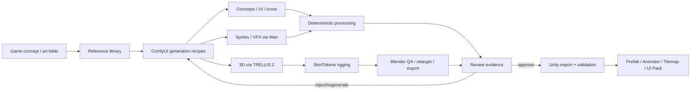
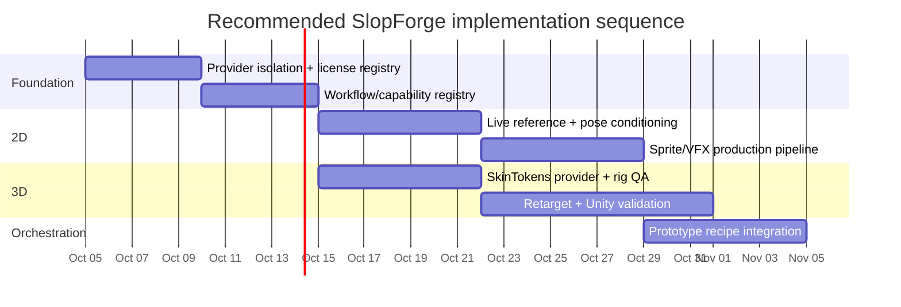

# SlopForge Game-Asset Generation Research Report

## Executive summary

SlopForge should treat **ComfyUI as the generative orchestration layer, Blender as the deterministic 3D/QA layer, and Unity as the final validation/runtime layer**. The strongest architecture is not “one giant ComfyUI workflow”; it is a recipe system that composes specialized providers and records every intermediate artifact.

One candidate stack to evaluate on the H100 is:

**Concept/reference generation → DWPose/reference conditioning → BiRefNet/Real-ESRGAN → Wan 2.2 for motion/VFX → TRELLIS.2 BF16 for 3D → SkinTokens for rigging → Blender for validation/cleanup/retargeting → Unity Humanoid/Generic validation.**

For automatic rigging, evaluate SkinTokens first in an isolated environment, but do not set it as SlopForge's default yet. Upstream calls it UniRig's successor and states MIT licensing, NVIDIA VRAM ≥14 GB, Python ≥3.11 and CUDA ≥12.1. The VRAM figure is an upstream requirement, not a SlopForge benchmark; training-data rights and deformation quality on SlopForge meshes remain unresolved. UniRig is a comparison candidate, not a proven fallback. citeturn21view0turn21view1

**Do not make ComfyUI-UniRig a core SlopForge dependency yet.** Its wrapper is GPL-3.0 and its install path uses Comfy-Env/Pixi; its manual instructions install/upgrade a separate dependency set. Keep it optional and isolated until the actual workflow/dependency stack is tested. The wrapper license and the licenses of bundled components/models are separate questions. citeturn22view8turn22view9

The H100 is particularly well matched to this strategy. TRELLIS.2 requires ≥24 GB, is validated on H100/A100, supports 512³–1536³ and full PBR materials, while Wan 2.2’s 5B video model can fit 24 GB with offload and its 14B paths officially target ~80 GB single-GPU operation. citeturn18view0turn19view1

The biggest best-practice principle is:

> **AI proposes; deterministic code packages; automated QA measures; humans approve.**

A sprite sheet should not rely on AI to align frames. A rig should not be accepted because a model returned an FBX. A UI pack should not bake button text. A 3D asset should not enter Unity before scale, topology, materials, pivots, skeleton and deformation checks have run.

## Recommended toolset

| Tool | Purpose | License / hardware | SlopForge recommendation | Priority |
|---|---|---|---|---|
| **SkinTokens / TokenRig** | Mesh → skeleton + skin weights | Upstream labels MIT; states NVIDIA ≥14 GB; Python ≥3.11; CUDA ≥12.1. Training-data provenance/rights still need review. citeturn21view0 | First isolated bake-off candidate; no default until SlopForge meshes pass topology, deformation, export and Unity checks. | Evaluation |
| **UniRig** | Two-stage skeleton prediction + skinning | MIT; Python 3.11; Torch ≥2.3.1; spconv/PyG/flash-attn dependencies; no official minimum VRAM stated. citeturn21view1turn22view0 | Keep as reference implementation/fallback and for comparing skeleton quality. | Nice-to-have |
| **ComfyUI-UniRig** | UniRig/MIA inside ComfyUI | GPL-3.0 wrapper; Comfy-Env/Pixi install path; separate bundled component/model terms. citeturn22view8turn22view10 | Optional isolated integration only after dependency and workflow validation. **Do not make core SlopForge depend on it.** | Optional |
| **Make-It-Animatable** | Fast humanoid-oriented bones, weights, poses | Repo MIT; MIA v2 uses Hunyuan3D 2.1 ShapeVAE. No official minimum inference VRAM found; A100 80 GB describes training settings. citeturn22view5turn22view6 | Research only for Ireland: Hunyuan3D 2.1's license excludes the EU; MIA code/model and backbone terms are separate. citeturn16view0 | Optional/research |
| **AniGen** | Single image → mesh + skeleton + skin | MIT source; Linux, ≥18 GB, CUDA 11.8/12.2. Repo includes a non-commercial CUBVH component for training, though it says inference does not need it. citeturn22view2turn22view3turn22view4 | Promising experimental end-to-end character provider; audit inference dependency/weights before commercial default. | Optional |
| **TRELLIS.2** | Image → 3D/PBR asset | MIT; ≥24 GB; H100/A100 validated; 512³–1536³; PBR base color/roughness/metallic/opacity. citeturn18view0 | Main props/environment/character-mesh generator. BF16 on H100; quantized model for constrained backends. | **Must-have** |
| **Wan 2.2** | Motion, animated concepts, VFX, sprites | Official repo/model pages label Apache-2.0 and document ComfyUI support. Published 80 GB guidance is for A14B T2V/I2V examples, not Animate-14B specifically. citeturn19view0turn19view2 | Evaluate Wan2.2-Animate-14B for character+motion-reference input; H100 fit and SlopForge output quality are unverified. | Evaluation |
| **BiRefNet_HR-matting** | Foreground masks/alpha | Model card labels MIT and describes 2048×2048 matting; repository documents ComfyUI integration. citeturn16search2turn16search30 | Candidate alpha stage; qualify edge quality and frame consistency on real sprite sequences. | Evaluation |
| **DWPose / MMPose** | Pose extraction/control | Apache-2.0; DWPose provides whole-body ControlNet-oriented pose estimation. citeturn11view1turn11view2 | Preferred pose abstraction for pose-locked sprite/character generation. | **Must-have** |
| **OpenPose** | Body/hand/face pose | Official project restricts free use to non-commercial use; commercial licensing separate. citeturn11view0 | Compatibility provider only; prefer DWPose/MMPose. | Optional |
| **Mixamo** | Humanoid animation library + web auto-rig | Adobe says downloaded characters/animations can be used royalty-free in personal, commercial and nonprofit projects; auto-rig is primarily biped/humanoid-oriented. citeturn8search7turn8search11 | Excellent animation-source/fallback provider, but manual/web-oriented rather than SlopForge’s automated core. | Nice-to-have |
| **Blender + Rigify** | Cleanup, controls, retargeting, validation, export | Blender’s official rigging ecosystem includes Rigify. citeturn23search1turn23search7 | Blender should remain SlopForge’s deterministic authority for geometry/rig QA and export. | **Must-have** |

The broader ComfyUI game-asset stack should therefore cover **concepts and style references, icons/UI, pose-controlled characters, sprites, VFX video, alpha extraction, super-resolution, PBR 3D and texture generation**. ComfyUI is explicitly designed as a server/API-driven modular inference engine, and its official documentation includes ControlNet and native BiRefNet workflows. citeturn13search8turn13search12turn16search30

## Pipeline architecture and game-asset best practices



### Model assets as graphs, not files

Each SlopForge asset should have `inputs[]`, `outputs[]`, `dependencies[]`, `derived_from`, generator/provider/model/version, workflow hash, seed, parameters, reference IDs, checksums, license metadata and `evidence[]`. A character is then naturally a graph containing concept, mesh, rig, materials and animations rather than “an FBX”.

Recipes should be **DAGs with idempotent stages**. Fingerprint inputs/configuration so successful children can be reused; regenerating an attack animation should not regenerate the character mesh.

### Separate identity from style

Use explicit reference roles:

```yaml
references:
  identity: [character/alice/front, character/alice/portrait]
  style: [style/gameplay]
  material: [material/painted_metal]
  pose: [pose/attack_01]
```

Do not dump every approved image into every prompt. Reference conditioning should be workflow capability metadata, not model-specific logic.

### Deterministic post-processing

AI output should immediately enter code-driven normalization:

**2D:** alpha/mask → common crop → scale → fixed canvas → pivot → frame ordering → atlas padding → metadata.

**3D:** transform/scale normalization → topology statistics → material/texture validation → optional decimation/LOD → pivot → rig → deformation QA → export.

TRELLIS.2 itself exports GLB/PBR assets and supports 4K texture export in its example pipeline, making GLB a good internal generated-asset representation before Blender processing. citeturn18view0

### Humanoid versus Generic

Use **Unity Humanoid** only where a character can map cleanly to Unity’s Avatar skeleton. That buys animation retargeting and muscle-space controls; Unity specifically recommends validating the Avatar mapping and proper T-pose even when automatic mapping succeeds. citeturn19view4turn23search34

Use **Generic** for creatures, quadrupeds, unusual robots and arbitrary skeletons; Generic rigs require a defined root node and do not receive Humanoid Avatar retargeting features. citeturn23search16

Every retarget test should check skeleton hierarchy, required bones, bind/rest pose, normalized weights, unweighted vertices, root motion, clip ranges, looping, foot contact and representative extreme poses.

## Integration, QA and ComfyUI operating practices

**Isolate ML providers.** Do not install SkinTokens, UniRig, AniGen or experimental rig nodes into the production ComfyUI Python environment. SkinTokens alone specifies Torch 2.7/cu128 and flash-attn, while UniRig requires its own spconv/PyG stack; ComfyUI-UniRig’s manual installation explicitly upgrades requirements. citeturn21view0turn21view1turn22view11

Use:

```text
ComfyUI service
SkinTokens service/venv
UniRig service/venv
Blender executable
SlopForge orchestrator
```

with file/API contracts between them.

For ComfyUI, version **API-format workflow JSON**, record its SHA-256, declare required node classes/models, and validate capabilities through `/object_info` before generation. Prefer HTTP upload/prompt/history/output retrieval for both localhost and remote hosts; SSH should exist only as a fallback for artifact types that the API genuinely cannot transfer.

On your 80 GB H100, use **BF16 as the quality default**, with FP8/INT8 as portability/concurrency profiles rather than the primary quality path. TRELLIS.2’s upstream implementation is designed for ≥24 GB and explicitly validated on H100, while Wan’s 80 GB guidance means your H100 can avoid some CPU/offload paths. citeturn18view0turn19view1

Treat custom nodes as executable third-party code: pin commits, audit installation scripts, store model SHA-256/licensing metadata, and keep ComfyUI Tailscale-only rather than public-facing.

Testing should have four levels: **mocked unit tests → deterministic fixture tests → opt-in live inference → visual QA evidence**. Store small contact sheets/reports, not giant generated binaries, with each live test.

Useful provider verification:

```bash
# Preferred current rigging provider
python demo.py \
  --input character.glb \
  --output character_rigged.glb \
  --use_transfer
```

SkinTokens documents exactly this CLI pattern. citeturn21view0

UniRig baseline:

```bash
bash launch/inference/generate_skeleton.sh \
  --input character.glb --output skeleton.fbx

bash launch/inference/generate_skin.sh \
  --input skeleton.fbx --output skinned.fbx
```

UniRig itself warns that incorrect skeleton prediction can significantly degrade skinning, which is why SlopForge needs a review gate between these stages. citeturn22view0

Verify an optional ComfyUI-UniRig installation without coupling code to node names:

```bash
curl -fsS "$COMFYUI_URL/object_info" |
  jq 'keys | map(select(test("unirig|rig|animatable"; "i")))'
```

For Blender, make validation headless and machine-readable:

```bash
blender --background --python validate_rig.py -- \
  character_rigged.glb evidence/rig-report.json
```

`validate_rig.py` should import the GLB/FBX and fail on no armature, unweighted vertices, invalid bone parents, missing armature modifiers, NaN transforms, empty actions or excessive deformation; then render a neutral/T-pose/crouch/elbow/leg-lift contact sheet.

## Minimal implementation roadmap



The first milestone should prove one coherent **2D character** and one **3D character** all the way into Unity rather than adding more architecture.

| Backlog item | Deliverable / acceptance test | Priority | Effort |
|---|---|---:|---:|
| Rig-provider sidecar | SkinTokens isolated env; GLB in → rigged GLB out; provenance | P0 | 3–5 d |
| Automated rig QA | Blender JSON + pose contact sheet; rejects broken weights/hierarchy | P0 | 3–5 d |
| Live reference/pose conditioning | Approved identity + DWPose reference demonstrably affects generated frames | P0 | 4–7 d |
| Production sprite recipe | idle/walk/attack → alpha-normalized atlas → Unity clips/controller | P0 | 5–10 d |
| Workflow capability registry | workflow hash, required nodes/models, `/object_info` preflight | P0 | 2–4 d |
| Retargeting pipeline | rig + idle/walk/run → Blender → valid Unity Humanoid or explicit Generic result | P1 | 1–2 wk |
| Animation library | reusable licensed clips with skeleton/root-motion metadata | P1 | 3–5 d |
| 3D character recipe | reference → TRELLIS → SkinTokens → Blender evidence → Unity prefab | P1 | 1–2 wk |
| Material/PBR QA | texture channels/resolution/material evidence + Unity validation | P1 | 3–5 d |
| Prototype orchestrator | concept → editable plan → multiple recipes → review board | P1 | 5–10 d |
| AniGen/MIA experimental providers | isolated comparison benchmark; licensing gate | P2 | 3–7 d |

The acceptance test worth optimizing the whole project around is:

> **One prompt/reference produces a coherent character identity, sprite animation, 3D mesh, validated rig, reusable locomotion animations, portrait/icon and Unity-ready outputs, with every stage reproducible and reviewable.**

Once that works, SlopForge has the right primitives to do the same thing for UI packs, modular environments, tilemaps, VFX, materials and entire prototype art directions.

## Primary sources and final recommendation

The most consequential primary sources are the official **SkinTokens** and **UniRig** repositories for rigging, Microsoft’s **TRELLIS.2** repository for PBR 3D generation, Alibaba’s **Wan 2.2** for motion, official **BiRefNet**/ComfyUI documentation for segmentation, and Unity’s Avatar/retargeting documentation. citeturn21view0turn21view1turn18view0turn19view0turn16search30turn23search34 AniGen and Make-It-Animatable are valuable research options but carry more integration/licensing uncertainty for a default production path. citeturn22view3turn22view5turn16view0

**Recommended SlopForge decision:** evaluate SkinTokens as the first isolated rigging candidate; compare Make-It-Animatable and UniRig only after exact model/checkpoint terms and dependencies are resolved. Do not name a production default or a reliable fallback before the same representative mesh set passes topology, deformation, export and Unity checks. Keep provider dependencies out of the stable ComfyUI environment and use Blender as a deterministic validation boundary.

## 2026-10-04 reconciliation addendum

This addendum checks selected claims against first-party model cards, repositories and Unity documentation. Upstream license labels and hardware requirements are reported as claims from those sources; they do not establish training-data rights, output quality, or SlopForge compatibility.

### Corrected provider findings

- **Qwen-Image-2.1** officially claims up to 10 reference images, identity preservation, native RGBA generation and ComfyUI examples. Its Qwen Research License is non-commercial absent a separate commercial license. Do not transfer those capabilities to the older base Qwen-Image: the base card labels Apache-2.0 but does not document the same reference/RGBA feature set. SlopForge has not run either model. Sources: [2.1 model card](https://huggingface.co/Qwen/Qwen-Image-2.1), [2.1 license](https://huggingface.co/Qwen/Qwen-Image-2.1/blob/main/LICENSE), [base model card](https://huggingface.co/Qwen/Qwen-Image), [official 2.1 repository](https://github.com/QwenLM/Qwen-Image-2.1).
- **Wan2.2-Animate-14B** is described by Wan as character animation/replacement from a character image and motion video; Wan's repo documents ComfyUI integration and Apache-2.0 code. The published ≥80 GB guidance concerns A14B T2V/I2V examples; no Animate-specific peak memory claim was found. H100 suitability remains an inference test, not an established fact. Sources: [Wan2.2 repository](https://github.com/Wan-Video/Wan2.2), [Animate-14B model card](https://huggingface.co/Wan-AI/Wan2.2-Animate-14B).
- **BiRefNet_HR-matting** model card describes 2048×2048 high-resolution matting and labels the artifact MIT; its example applies the prediction as an alpha mask. This makes it a candidate fallback, not a promise of clean sprite edges. Sources: [model card](https://huggingface.co/ZhengPeng7/BiRefNet_HR-matting), [official repository](https://github.com/ZhengPeng7/BiRefNet).
- **SkinTokens** upstream states MIT, Python ≥3.11, CUDA ≥12.1 and NVIDIA GPU memory ≥14 GB; the figure is not an independent SlopForge benchmark. It is the first isolated bake-off candidate, not a chosen provider. Training-data rights and deformation quality remain unresolved. Sources: [repository](https://github.com/VAST-AI-Research/SkinTokens), [model card](https://huggingface.co/VAST-AI/SkinTokens).
- **Make-It-Animatable** repository is MIT and v2 uses Hunyuan3D 2.1 ShapeVAE; no official minimum inference VRAM was found. Its code/model terms do not override Hunyuan3D 2.1's territory restrictions. Sources: [repository](https://github.com/jasongzy/Make-It-Animatable), [v2 branch](https://github.com/jasongzy/Make-It-Animatable/tree/v2), [Hunyuan3D 2.1 license](https://github.com/Tencent-Hunyuan/Hunyuan3D-2.1/blob/main/LICENSE).
- **ComfyUI-UniRig** is GPL-3.0, supports UniRig/MIA, and recommends MIA for humanoids. That wrapper license does not itself prohibit commercial use; bundled components, model terms and redistribution obligations need separate review. It is not evidence of a SkinTokens integration. Sources: [repository](https://github.com/PozzettiAndrea/ComfyUI-UniRig), [license](https://github.com/PozzettiAndrea/ComfyUI-UniRig/blob/main/LICENSE).
- **Unity Humanoid** retargeting depends on mapping source bones to a valid Avatar. The importer defaults to Standard (4 Bones) and recommends that setting for performance. Keep valid rig import, valid Avatar and successful retargeting as separate acceptance results. Sources: [Avatar configuration](https://docs.unity3d.com/6000.6/Documentation/Manual/ConfiguringtheAvatar.html), [FBX rig import settings](https://docs.unity3d.com/6000.6/Documentation/Manual/FBXImporter-Rig.html).

### Qualification levels

Use these labels in workflow/provider records and docs: **declared** (artifact exists); **preflight_validated** (declared nodes/models are visible); **inference_tested** (real inference completed); **technically_validated** (deterministic checks passed); **visually_qualified** (representative results reviewed); **production_default** (qualified as a normal default). Preflight must not imply inference or visual quality.

### Revised roadmap

1. **#20 implemented:** bundled workflow requirement manifests and explainable preflight. Remote node revisions and model hashes remain unverified by ComfyUI's API.
2. **Next: live visual-conditioning qualification** as a follow-up to #6. #6 remains closed because its transport/binding/provenance acceptance passed; live visual effect was outside its implemented test evidence.
3. **#9** sprite pipeline qualification: identity, distinct motion, actual alpha, stable anchor, deterministic pack and visible Unity playback.
4. **Animation-readiness gate**, then **#14** rigging-provider bake-off on the same representative meshes.
5. **#15** known-good animation retargeting and Unity Humanoid/Generic validation; **#16** concept-aware orchestration; **#19** fresh idea-to-prototype acceptance run.

No model or custom node was installed and no inference was run for this research reconciliation.
